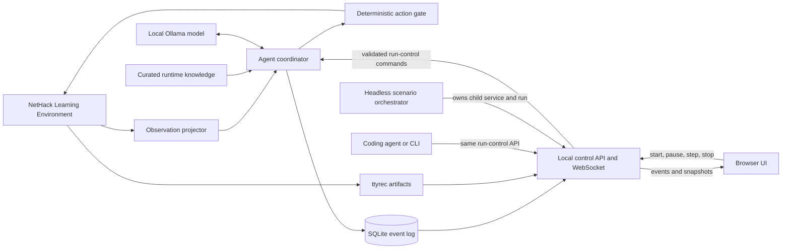

# Architecture

## Goal

Build a local, autonomous NetHack agent whose long-term success criterion is ascending with the Amulet of Yendor. Development and debugging may use online coding agents; gameplay must remain offline except for loopback communication with local services.

## Current status

The deterministic NLE adapter, immutable observation projector, typed traversal planner, per-level dungeon memory, deterministic staircase-navigation, exploration, gold-navigation and bounded hunger skills, contextual action gate, structured Ollama decision model, reviewed local knowledge, typed SQLite event log, loopback control service and browser UI, scenario orchestrator, network-boundary verifier, exhaustion-marker replay, and policy-pinned evaluation harness with typed metric thresholds are implemented. Milestone 1, traversal-policy, and survival-policy evidence remain accepted or recorded as they were; the current behavior is `hierarchical-task-progression-v1`.

## System context

## Component boundaries

### `nethack-agent/`

The product domain. It owns the Python application, local-model integration, NLE adapter, run data, web service, browser assets, evaluation suites, and compact knowledge supplied to the playing model. It can become a separate repository later without moving unrelated project history.

### NLE adapter

Use the maintained [`NetHack-LE/nle`](https://github.com/NetHack-LE/nle) package through its Gymnasium API. The first task was `NetHackStaircase-v0`; runs now also execute `NetHackScore-v0` traversal objectives, and the eventual full-game environment is `NetHackScore-v0` or a narrowly derived environment if a proven requirement appears.

The adapter must:

- pin the NLE release and expose its version in run metadata;
- select a fixed beginner-friendly character, initially lawful dwarven Valkyrie (`val-dwa-law`);
- save every evaluated episode as ttyrec;
- use explicit seeds and deterministic time-derived effects when supported;
- expose only legitimate observations to the policy; NLE's internal task state must never enter a model prompt;
- translate model intent into the finite action set and reject invalid actions before calling `env.step`.

`NleEnvironment` implements the current boundary. Each run executes one typed
`tasks.TaskSpec` (`ScenarioConfig.task`, default `STAIRCASE_TASK`): an NLE task
id (`NleTask`: Staircase, Score, Scout, Gold, Eat, Oracle), an action profile,
and a `traversal.Objective`. `NetHackStaircase-v0` accepts only its single
`stand_on_stairs(down, any)` leg and `NetHackScore-v0` any stair or level legs.
`NetHackScout-v0` with `nle-task-actions` and `NetHackEat-v0` with
`nle-hunger-actions` each accept exactly one `explore_dungeon` leg, which no
other task accepts; Gold and Oracle are rejected until ADR 0004 section 8
defines their objectives. An `ActionProfile` is a named, code-defined tuple of NLE action
members. `nle-task-actions` is NLE's 23 `TASK_ACTIONS`.
`nle-hunger-actions` keeps those actions in order, then adds ESC and one enum
member for every otherwise-missing `a-z`/`A-Z` inventory letter, deduplicated
by integer command value. The additions have static role `prompt_key`; existing
movement-letter collisions keep their routine movement role. The adapter
passes the selected tuple as NLE's `actions=` argument and fails construction
unless the raw environment's action table equals it. A suite seed is
deterministically expanded into separate core, display, and level-generation
seeds; NLE reseeding is disabled and time-derived effects use the seed. The
adapter requests only public observation keys, passes each task's own NLE
option choice (NLE applies it only when no options are given; Gold's is
`pickup_types:$`) plus an explicit `autoopen` rather than relying on NetHack's
default, represents its finite action set as typed index/command/name records,
and rejects invalid indices before NLE. Gymnasium's `TimeLimit` enforces the
episode cap and reports it as `truncated`; NLE's own abort, which would report
a cap as a terminated `end_status` -1 episode and defaults to 5,000 steps,
receives `cap + 1` through the registered spec's kwargs so it never fires
first. NLE zeroes the bottom-line statistics of a terminal observation, so no
level, position, or objective is read from one.

NLE reuses its NumPy observation buffers. `NleObservation` therefore exposes
zero-copy views that are valid only until the next `step` or `reset`. Consumers
must project or persist needed values before advancing the environment; they
must not retain raw observations as event history.

### Observation projector

`ObservationProjector` converts each ephemeral NLE observation into compact,
immutable state before the next environment call. It copies visible map
characters plus glyph IDs (`glyph_rows`), color, special bytes, and an explicit
per-cell pet mask (`pet_rows`) derived only from NLE's pet-glyph identity. Map
display characters use stable glyph identities to render boulders as `0` and
the ghost monster class as `X`; the original glyph IDs, NetHack colors, and
player cell rendering remain authoritative. The projection also includes all
public bottom-line statistics, decoded message and inventory strings, prompt
flags (`single_character_choice` for single-character prompts, `text_input`,
and `wait_for_space`), and changed map cells with their updated glyph,
character, and pet data. NLE exposes inventory glyph, letter, object-class, and
description arrays but no BUC array. The projector therefore derives a typed
`BucStatus` only from an exact leading `blessed`, `uncursed`, or `cursed`
adjective after an article or stack count; every other description is
`unknown`. The result is JSON-serializable for prompts, persistence, APIs, and
UI clients. Map deltas are computed against the previous projection without
retaining NLE buffers. Raw arrays do not cross this boundary.

Every new projection records pet evidence. Observations persisted before pet
evidence existed (including the accepted milestone 1 suite) have no `pet_rows`
or changed-cell `pet`; they load with pet evidence *unknown* (`pet_rows: None`,
`pet: None`, serialized as JSON `null`), never as an invented all-zero mask.
Present pet fields are still strictly validated (hex rows of the map shape with
0/1 bytes; boolean `pet`), and unknown extra fields are rejected. The browser
highlights no pet when evidence is unknown.

Inventory observations stored before `buc` existed load as `unknown`; the
reader never reparses their description and invents evidence. Present values
must be one of the four enum states. This follows the same evidence rule as
legacy pet observations.

### Agent coordinator

A state machine, not an open-ended chat loop. It owns run lifecycle (`idle`,
`running`, `paused`, `terminal`, `stopped`, and `error`), current goal, active
skill, model cadence, inference retries, and action execution. `Skill` is an
enum; `SkillDecision`, `ActionDecision`, `ActionSelection`, and their metrics
are immutable typed records. Goals are the typed `traversal.Goal` union
([ADR 0004](docs/decisions/0004-traversal-goals-and-task-progression.md)):
`stand_on_stairs` or `traverse_stairs`, each with a `StairTarget` (direction
`up`/`down` and connection `any`, `main`, or `branch` with a dungeon number),
or `explore_level` with the `LevelKey` to explore and no staircase target.
They persist as objects such as
`{"kind": "stand_on_stairs", "target": {"direction": "down", "connection": "any", "dungeon_number": null}}`
or `{"kind": "explore_level", "level": {"dungeon_number": 0, "dungeon_level": 2}}`;
the string `stand_on_downstairs` stored before typed goals reads as exactly that
goal. The model is offered goals by token (`stand_on_stairs:down:any`,
`explore_level:0:2`) through a per-call generation schema, and the parser maps
a token back to the offered goal. `approach_oracle` (token
`approach_oracle:<dnum>:<dlevel>`) is a typed, strictly parsed goal with no
behavior yet: the planner never produces it, and prompt text and skill
selection raise on it.

Each run's `TaskSpec` objective (1-8 legs: `stand_on_stairs`, `reach_level`,
`enter_dungeon`, `explore_dungeon`) drives `planner.ObjectivePlanner`, a pure
function of the current leg and dungeon memory that sets every step's goal. A
`stand_on_stairs`
leg keeps that goal. A `reach_level` leg in the same dungeon takes the main
staircase toward the level; from another dungeon it retraces the recorded
branch link. `enter_dungeon(2)` (the Gnomish Mines; Sokoban's number 4 is
unverified) descends to the DL2-4 branch range, searches each range level for
a second `>`, probes two unknown `>` (the nearest first), moves on when a
level is exhausted with one `>`, and re-arms each exhausted range level's
exploration once before giving up. `explore_dungeon(max_level)` requires
every Dungeons of Doom level 1..`max_level` to be explored: it plans
`explore_level` on the shallowest unexplored required level, main stairs
toward it otherwise (so a level skipped by a trap door is revisited by
climbing), and retraces the branch link out of another dungeon. A level is
explored once exploration has found it exhausted; that flag, unlike
`exhausted`, survives later knowledge growth. A strict `find_oracle` leg
(`{"kind": "find_oracle"}`) is parseable but has no behavior yet:
`ObjectivePlanner` refuses any objective containing it, and `TaskSpec` rejects
`NetHackOracle-v0` as "not supported yet". `NetHackGold-v0` takes one
`explore_dungeon` leg with `nle-task-actions`. Legs are
checked after every step whose NLE episode continues (NLE zeroes the
bottom-line statistics of a terminal
observation). On `NetHackStaircase-v0` (and later Oracle) NLE's success
state ends the run; on other tasks, completing the last leg ends it with
`objective_complete` and closes NLE. The coordinator snapshot reports the
current leg (`objective_leg`) and the last live `level`.

Model role ([ADR 0002](docs/decisions/0002-deterministic-skill-arbiter.md)):
a deterministic arbiter, not the local model, chooses the executing skill on
every step. The model's start-of-episode goal and skill decision is recorded
but cannot override the arbiter. Its choice is binding only in a stuck
consultation, and it supplies actions only for unhandled prompts and stuck
fallbacks. Later milestones should return genuinely contextual choices to the
model: resource/risk trade-offs before descending, prayer or recovery,
high-priority threats, and branch plans. During a fixed episode it may handle
an unfamiliar state but cannot modify the policy. Between runs or suites,
coding agents review persisted evidence and either revise reviewed knowledge
or implement a deterministic skill for a simple recurring case.

`AgentCoordinator` consults the model for skill at the start of an episode,
offering exactly the planner's goal and the skills that can serve it
(`decision.model_selectable_skills`): staircase navigation and exploration for
a stair goal, exploration alone for an `explore_level` goal. A deterministic
arbiter owns execution; the hunger and gold-navigation skills are never model
choices. Per step, in
order:

1. a pending direction prompt from exploration's own kick is answered;
2. on `nle-hunger-actions` runs, `HungerSkill` continues its one-prompt
   sequence or, with no prompt active, proposes `EAT` only at NLE hunger value
   2 (Hungry) or worse and only for the first inventory-letter-sorted item
   whose typed letter, food object class, exact normalized food-ration
   description, and BUC evidence agree;
3. `SafePromptHandler` acknowledges wait-for-space prompts, cancels text input,
   and declines recognizable yes/no prompts, including peaceful attacks and
   floor-food `eat it?`;
4. any other prompt goes to the model as a fallback action;
5. `StaircaseNavigationSkill` ranks remembered compatible staircases by
   established identity before a probe, then route distance, row, and column.
   On the chosen staircase it fights an adjacent safe-to-melee hostile before
   either waiting or traversing. Stepping onto an adjacent staircase still
   completes or enables the goal immediately;
6. on `NetHackGold-v0` under an `explore_level` goal, `GoldNavigationSkill`
   routes onto the reachable cell whose current glyph is exactly the gold-piece
   glyph (`LevelMemory.gold`, rederived from every observation and never
   remembered), ranked by route distance, row, and column and skipping goals
   abandoned for oscillation. It fights an adjacent safe-to-melee hostile
   first. NLE's `pickup_types:$` picks the gold up; there is no pickup command.
   Its intent has a `gold` destination, only `gold_navigation` steps may carry
   one, and the evaluator reports an integrity problem when that cell did not
   show the gold glyph on the level of the observation the step was decided on;
7. `ExploreLevelSkill` acts, biased toward unreachable compatible staircases
   of a stair goal, or reports a typed `StuckReason`. The first
   `search_exhausted` report at the level's current knowledge marks the level
   exhausted and explored and records `selection.exhausted_level` on that
   step. If that completes the current leg, the step is a deterministic
   `WAIT` confirmation, so the final required level completes without a model
   consultation. Otherwise the coordinator replans before a stuck
   consultation. A decision discarded by a pause or failure restores the
   level's exhaustion marks, so every recorded marker matches memory.

Navigation and exploration both route over the current
`navigation.LevelMemory`, a bounded
per-level record of the 21x79 map owned by the coordinator's
`navigation.DungeonMemory`, which keeps one record per `(dungeon_number,
dungeon_level)`. A level record remembers the last terrain glyph of every cell
(NetHack draws the hero, monsters, and objects over terrain), the cells the
hero has been adjacent to, search coverage, learned blocked moves, locked
doors, kicks, peaceful monster glyphs, stair identities and links, and whether
exploration exhausted it; these persist across visits. Abandoned goals,
suspect edges, the position history, waits, stuck consultations, and pending
actions are cleared whenever the hero enters the level, and everything resets
on `start`. The look-here messages "There is a staircase down/up here." mark a
staircase hidden under an object. A stair action followed by a level change
links both staircases and records their identities (`traversed` and
`arrival`; returning by a staircase the hero already used keeps its
`traversed` evidence); on a level with two staircases of one direction the
complement of an established one follows by `elimination`, and `<` on (0, 1)
is the dungeon exit by `rule`. A level change without a stair action (a trap
door, hole, or level teleport) links nothing, and main versus branch stairs
cannot be told apart before one of these rules applies. Current limits: a
Mines entrance behind a secret door can be missed; Sokoban's dungeon number is
inferred from `dungeon.def` order and has not been reached; and ladders and
portals are not stairs. Survival policy is intentionally narrow: it has no
retreat, rest, weapon, floor-food, general inventory, prayer, or speculative
navigation policy.

Breadth-first routes follow NetHack 3.6.7 `test_move`: no diagonal move into or
out of an open or closed door (doorless and broken doorways allow diagonals),
closed doors are entered orthogonally because moving into one opens it,
diagonal squeezes between rock are allowed for the medium-sized, lightly loaded
hero, and boulders and known traps are never routed through. Visible non-pet
monsters block routes; pets are displaced. Explicit refusal messages ("It's a
wall.", diagonal-door refusals) block an edge for the level; three unexplained
failed moves only mark it suspect.

`ExploreLevelSkill` attacks an adjacent displayed monster unless it is a pet,
has answered a "Really attack?" prompt, or is on the never-melee list. That
list covers passive-damage monsters (floating eye, gas spore, molds and
jellies) and the always-peaceful Oracle by exact public monster glyph/name, so
the first adjacent observation cannot attack her before peacefulness is
learned. NLE's task action set has no fight command, so attacks move into the
monster. Exploration then walks to the nearest
reachable frontier, a known cell next to never-observed blank space, with
doorways and corridors winning distance ties and a remembered but unreachable
`>` biasing the choice toward it. A frontier reachable only past a monster is
approached, fought, or waited on (bounded). With no frontier it kicks a known
locked door that leads into unexplored space, only on dungeon level 1, where no
shopkeeper or watch exists. Otherwise it searches: candidate spots are room
cells beside straight walls and corridor dead ends, scored by never-observed
cells near the walls or rock they cover minus twice the travel distance; each
adjacent cell counts until searched 10 times per round, and the chosen spot
stays committed until spent. Routing that dithers among at most six cells for
12 moves, or 100 routed moves without new knowledge, abandons the goal until
the map changes. When no spot remains the skill reports `search_exhausted` (or
`monster_blocked`).

A stuck report triggers a model skill consultation, at most once per 20 stuck
steps. Choosing `explore_level` re-arms exploration (a new search round, cleared
suspect edges and abandoned goals); choosing `staircase_navigation`, or a
re-armed exploration that still cannot act, yields a model fallback action.

Every proposal passes through `ActionGate`, which verifies the finite action
index and its profile role. Level changes require a matching
`TraversalPermit`; `EAT` requires a `HungerPermit`; added `prompt_key` actions
require a `PromptPermit` for the same integer command. None of those actions is
offered to model fallback, and fallback inventory rendering omits raw letters.
An existing movement-letter collision remains a routine action, but the same
prompt predicate can authorize it as a deterministic response when that exact
letter is offered.

The hunger permit predicate requires a `deterministic_skill` selection by
`hunger`, no active prompt, NLE hunger 2 or worse, and an explicitly recognized
safe ration in the decided-on typed inventory. The prompt permit predicate
requires `deterministic_prompt`/`hunger`, an active exact NLE eat-item prompt,
and either ESC or a command literally present in its offered letters. The
one-step pending ration is cleared after the next observation; changed,
missing, or unoffered item evidence cancels the recognized prompt with ESC.
The shared structural predicate also rejects invalid persisted EAT and added
prompt-key selections during event construction.

The traversal permit remains as in ADR 0004. The shared
`decision.level_change_error` predicate requires a level-changing objective,
a same-direction `traverse_stairs` goal, deterministic staircase navigation,
an in-place intent on the hero's matching remembered staircase, compatible
identity and pair evidence, no prompt, and not `<` on `(0, 1)`. A refusal
pauses the run. A step records its typed goal and executed skill, action source
(`deterministic_skill`, `deterministic_prompt`, or `model_fallback`), skill
selection source, stuck reason, optional map intent, and applicable model
decisions and metrics. This is an auditable decision trace, not
chain-of-thought.

The map intent (`decision.ActionIntent`) comes from the deterministic skill's
own routing data, never from the action direction or rationale text. It has an
optional `destination` with a `DestinationKind` and zero-based map
coordinates, and an optional `attack_target` cell; at least one is present:

- `downstairs` and `upstairs`: the remembered `>` or `<` staircase navigation
  routes to, steps onto, waits on, uses, or keeps while it first fights an
  adjacent hostile. A stair destination also records the `stair` identity the
  skill believed (`main`, `branch` with a dungeon number, `exit`, or
  `unknown`, with `traversed`, `arrival`, `elimination`, or `rule` evidence)
  and `pair_known`, whether memory held two staircases of that direction, the
  evidence that lets an unknown staircase be probed as a branch;
- `frontier`: exploration's route goal next to never-observed space, including
  when the route first opens a door or waits for or attacks a blocking monster;
- `search_spot`: the committed spot exploration walks to and searches from;
- `locked_door`: the door exploration walks beside, kicks, and aims its kick
  at;
- `attack_target`: the displayed hostile monster the action attacks by moving
  into it. Exploration fights before choosing a frontier, so its attacks carry
  no destination.

The destination is usually not the adjacent cell the action steps into. The
coordinator stamps every skill intent with the `level` (dungeon number and
dungeon level) its cells belong to. The browser draws an intent only on that
level's map, so the step that uses a staircase shows its intent only in the
Events row.

The intent's optional `path` is the route the action follows, as computed by
the skill's breadth-first `RouteTree` for this step: the ordered cells after
the hero's position, starting with the cell the action moves into and ending at
the destination (for a locked door, at the cell orthogonally beside it where
the hero kicks). The skill takes its move from this same route, so the path is
never recomputed for display. Skills replan every step; there is no persistent
multi-step plan. The path is `null` when the action follows no route: waiting
on `>`, waiting for a peaceful or passive blocker, searching in place,
kicking, and adjacent-hostile defense (the route to the destination is not
taken on that step). A present path has 1 to 21 × 79 cells, needs a
destination, never revisits a cell, is king-move contiguous, ends as above,
starts at the attack target when both exist, and stays inside the observation
map.

Prompt answers and model fallbacks carry no intent; the contract rejects an
intent on any non-`deterministic_skill` selection. Recording the intent and
path does not change any action choice.

`OllamaDecisionModel` implements both model boundaries. Skill selection's
per-call schema includes only the supplied traversal skills and goals;
deterministic hunger is not supplied. Ambiguous action fallback uses
`ACTION_DECISION_SCHEMA` and only the gate's routine allowed actions, excluding
level changes, `EAT`, and added prompt keys. Its inventory summary deliberately
omits raw inventory letters. It allows at most three candidates, 100-character
candidate reasons, and 200-character rationales.
Both paths disable thinking, use temperature 0, a 512-token output cap, and an
explicit `num_ctx` (default 8,192, `NETHACK_AGENT_OLLAMA_NUM_CTX`). A reported
prompt that leaves less than 512 tokens of that window raises
`OllamaContextLimitError` as a failed attempt, because Ollama may have
truncated it silently. Both paths reject duplicate keys and malformed or
semantically invalid values, and perform exactly one schema-repair retry. A
second failure raises `DecisionFailure` with both attempt diagnostics, token
counts, measured client elapsed durations, and reported Ollama durations.
Aggregate latency uses Ollama `total_duration` when available and wall-clock
duration when a failure returns no generation metrics. Both prompts include the
same bounded reviewed-knowledge context. The explicit scripted development model
does not read or use knowledge; it always chooses `explore_level` and falls
back to waiting.

`start` resets NLE into `paused`; `advance` performs one hierarchical action
while `running`, or one single step while `paused`. An explicit in-flight
revision protocol allows only one advance to decide from an observation. Model
inference runs outside the lock, so pause or stop during inference invalidates
and discards the pending skill or action decision. Level memory folds in each
observation idempotently and learns from an action only after NLE executed it;
the one exception is a stuck re-arm chosen by the model, which is kept if a
pause then discards the step because it only widens the search budget.
`DecisionFailure` and
action-gate rejection pause with structured diagnostics; an unexpected model,
NLE, projection, or persistence failure moves the run to `error`, closes NLE,
and finalizes the ttyrec. Truncation, death, and task success are terminal and
also close NLE.

### Knowledge layers

Two audiences require separate material:

1. `_agents/skills/` contains tools and procedures for online coding agents working on the repository. These may inspect the ignored NetHackWiki dump and produce reviewed project changes.
2. `nethack-agent/knowledge/` contains concise, versioned, cited facts injected into the local playing model's context.

The 188 MB wiki XML dump is source material, not a runtime prompt and not committed. Automatic extraction must not become trusted gameplay knowledge without review. Policy, prompts, skills, model identity, and knowledge remain fixed throughout an evaluation suite; there is no online self-modification.

`knowledge.load_default_knowledge_bundle()` still selects only
`knowledge/manifest.json` (`staircase-reviewed-v3`). A named
`knowledge.load_knowledge_bundle(directory, bundle_id=\"survival-reviewed-v1\")`
selects its own allowlisted `manifest.survival-reviewed-v1.json` without
switching the current policy, service default, or any committed suite pin.
Each manifest pins direct Markdown cards in prompt order by SHA-256; the
loader rejects missing, tampered, duplicate, escaping, oversized, or
malformed cards and requires canonical NetHackWiki sources, retrieval date,
reviewed dump path, version applicability, uncertainty, and CC BY-SA 3.0
attribution. It renders only facts and non-goals, rejects context above the
manifest bound (at most 6,000 characters) or 1,500 estimated tokens, and
derives `<bundle_id>+sha256:<digest>` from the canonical manifest plus exact
card bytes. There is no runtime network access, raw-dump access, or dynamic
retrieval.
`RunManager` loads one bundle at service construction and records
its version in every run; packaged wheels include the same directory. Explicit
scripted development runs record the service's bundle version for comparable
metadata but do not consume its prompt context.

The current `staircase-reviewed-v3` bundle makes scenario `autoopen` explicit
and replaces the milestone staircase card with the direction- and
identity-neutral `stairs-traversal` card. That card distinguishes standing on
a staircase from using it, documents the additional same-direction stairs at
the Gnomish Mines and Sokoban branch entrances, the dungeon exit from the
level-1 upstairs, and that NLE's one displayed glyph does not reveal stairs
under a covering object or monster except through the look-here message. It
states no stand-or-use policy: the goal-derived prompt text says whether the
current goal stands on or uses a staircase, and model fallbacks are never
offered `<` or `>`. The earlier `staircase-reviewed-v1` and `-v2` bundles
remain the knowledge of the accepted milestone 1 reports.

The new **not yet active** `survival-reviewed-v1` bundle retains staircase
and exploration guidance, and adds cited prayer/hunger and conservative
fresh-corpse cards; `safe-interaction` remains in the default bundle but is
omitted from the named one to meet the fixed context budget. Its verified
context is 5,917 characters / 1,480 estimated tokens. An observed kill on
the corpse's cell within 19 game turns is required for ordinary low-risk
corpses; uncertainty about curse, age, identity, or prayer timeout is never
converted into an asserted safe action. Gate/skill adoption belongs to a
later policy version, not this review
([note 0024](docs/notes/0024-reviewed-survival-knowledge.md)).

### Persistence and replay

SQLite is the authoritative structured event log. Every run will record configuration and version identifiers, seeds, projected observations, goals, candidate actions and scores, chosen action, concise rationale, inference timing and token counts, rewards, errors, and terminal outcome. Large binary arrays should not be duplicated in every event. NLE ttyrec files provide native episode replay and are referenced from the run record.

`RunStore` implements this log in `<data-dir>/runs.sqlite3` (WAL mode with
foreign keys enabled). Every per-operation SQLite connection is explicitly
closed. The `runs` table holds scenario configuration, derived seeds,
environment, character, model, policy, knowledge, NLE and Ollama versions, the
Ollama `num_ctx` (`ollama_num_ctx`; stores created before it existed gain the
column with `NULL` for older runs), the canonical `TaskSpec` JSON (`task`; its
`environment` must equal the `environment` column, and runs stored before it
existed read `None`, never an inferred staircase task),
state, outcome, last error, and the ttyrec path. The `events` table holds
per-run JSON payloads with contiguous sequence numbers starting at 0. State
updates and their corresponding events commit in one transaction with
expected-state guards, so pause or stop cannot be overwritten by a late step.
Each run's NLE artifacts live in a unique episode directory below
`<data-dir>/runs/<run-id>/`.

The run manager records six discriminated event variants: `run_started`,
`run_resumed`, `run_paused`, `step`, `agent_error`, and `run_stopped`. Each
variant has an immutable dataclass payload and an `EventKind`; free-form event
kinds and payload dictionaries do not cross the store boundary. Serialization
occurs when SQLite writes an event, and every read strictly deserializes the
stored kind and exact payload shape. Unknown kinds, malformed JSON, duplicate
keys, invalid nested observations or decisions, and semantically inconsistent
step payloads fail with a clear stored-event contract error. HTTP and WebSocket
consumers receive the same stable `{sequence, created_at, kind, payload}` JSON
envelope. Step events include the action selection (source, goal, executed
skill, skill-selection source, stuck reason, rationale, and map `intent`),
optional model skill/fallback decisions and metrics, gated action, reward,
termination fields, outcome, and the projected observation. A present intent is
strictly validated (exact fields, a known destination kind, non-negative
integer cells inside the observation map, and the path rules above). Events
recorded before the `hierarchical-explore-v1` selection fields existed no
longer satisfy the strict reader; their evaluation reports remain the evidence
for those runs. Events recorded before pet evidence, map intents, or intent
paths existed, which include the accepted milestone 1 suite, remain readable
through the store, HTTP API, browser UI, and evaluation audit: pet evidence is
unknown, as described under the observation projector, an absent `intent`
reads as JSON `null` (no intent recorded), and an absent intent `path` reads as
`null` (no route recorded), never as an inferred target or route. Intents
recorded before levels, stair identities, and staircase-pair evidence read
with `level: null`, `stair: null`, and `pair_known: null` (not recorded), and the goal string `stand_on_downstairs` reads
as the typed goal it meant. New selections always write `exhausted_level`
(null unless the step's decision found that level exhausted; a prompt answer
never carries one); selections recorded before it existed read it as `null`
(not recorded). A step's `outcome` is required exactly when NLE
terminated or truncated the episode, except `objective_complete`, which the
coordinator records when it ends a run whose NLE episode continues.
Inventory records written before typed BUC evidence remain readable in the
same way: absent `buc` becomes `unknown`, never a description-derived claim.

The exact-field construction helpers and domain parsers remain authoritative
instead of adding a second runtime JSON Schema validation pass; see
[ADR 0003](docs/decisions/0003-typed-contract-construction.md). Ollama's two
JSON Schemas constrain generation but do not replace domain parsing,
duplicate-key rejection, enum/dataclass construction, contextual errors, or
cross-field validation.

### Control and observation surface

A local Python service exposes a client-neutral HTTP control/status API and
streams events over WebSocket. Both the browser UI and coding-agent tools use
this API; neither communicates with the coordinator directly. A coding agent
can therefore launch the service, start a run for a specific task and seed,
observe it, pause or single-step it, and stop it after collecting evidence.

Run creation accepts validated run execution parameters (`seed`,
`max_episode_steps`, `auto_start`, and an optional `task`) with strict types
(`StrictInt` and `StrictBool`, with `extra="forbid"`, and the `TaskSpec` domain
parser for `task`) rather than arbitrary command lines. The character
(`val-dwa-law`), model (`gemma4-nethack:latest`), policy
(`hierarchical-task-specialists-v1`), and knowledge settings are fixed by the service
configuration rather than accepted per request. A run without `task` executes
the legacy staircase task and action profile; a supplied traversal task's
objective and action profile drive the coordinator.

Lifecycle commands are serialized through the coordinator state machine. Stop
is idempotent and graceful: close NLE, flush SQLite events, finalize the ttyrec
reference, and report the terminal state without duplicating stop events on
repeated calls.

`nethack-agent serve` implements this service with FastAPI and uvicorn, managing
graceful shutdown through FastAPI's lifespan context (`manager.close`). It binds
only to loopback hosts (`127.0.0.1`, `localhost`, or literal IPv6 `::1`), with
`localhost` pinned specifically to `127.0.0.1`. Both `ControlClient` and
`OllamaClient` normalize endpoints to literal loopback addresses and bypass
HTTP proxies. `RunManager` owns at most one active run per process and ensures
that at most one worker advances it at a time.

- `GET /api/health`;
- `POST /api/runs` with strict typed payload (`seed` as `StrictInt`, optional
  `max_episode_steps` as `StrictInt` default 5000, optional `auto_start` as
  `StrictBool` default false, and optional `task` as a `TaskSpec` object
  defaulting to the staircase task; an invalid spec returns 422);
- `GET /api/runs/{id}` for the typed run record, coordinator snapshot with
  current observation, current goal and skill, objective leg, last live level,
  and legal actions;
- `GET /api/runs/{id}/events?after=N&limit=M`, where `after` is an exclusive
  sequence cursor, `limit` is 1-1000 (default 100), and the response returns
  `events`, `next_after`, `has_more`, and `limit`;
- `POST /api/runs/{id}/pause`, `POST /api/runs/{id}/resume`,
  `POST /api/runs/{id}/step`, `POST /api/runs/{id}/stop`;
- `WS /api/runs/{id}/events/ws?after=N&limit=M`, which performs bounded history
  replay and live event streaming, offloads SQLite queries asynchronously to
  worker threads (`asyncio.to_thread`), and actively monitors client
  disconnection; it closes cleanly with code 1000 after the run reaches
  `terminal`, `stopped`, or `error`.

Unknown HTTP runs return 404 and unknown WebSocket runs close with code 4404.
Invalid lifecycle transitions and a second active run return 409; model
decision and action-gate failures return 503; coordinator invariant failures
return 500. The character, model, policy, and knowledge versions are fixed by
the service configuration rather than per request. Run control
lives in memory: after a service restart, earlier runs remain readable but
cannot be controlled, and their stored state is not reconciled.
`ControlClient` and
`nethack-agent run start|status|pause|resume|step|stop|events` use this API from
the command line. `run` remains client-only and never owns the service.
`ControlClient` validates health, status, and event-page response shapes,
iterates every cursor page, applies finite monotonic readiness and state
deadlines, and reports malformed responses, timeouts, and unexpected paused,
terminal, stopped, or error states distinctly.

`nethack-agent scenario run` is the owning headless path. It accepts one strict
configuration with a positive seed and episode cap, a loopback host and valid
port, a finite timeout, a data directory, and exactly one of autonomous or
bounded-step execution. It launches the service as an argument-vector child
without a shell, waits for health, creates and drives the run, retrieves all
event pages, and then stops any active run before gracefully signaling and
reaping the child. The same cleanup runs on API failures, deadline expiry, and
interrupts. `--json` emits one machine-readable result. The existing `run`
commands intentionally remain usable against an independently managed service.

`--development-scripted-model` explicitly selects a deterministic no-Ollama
model for development checks. It is never selected as a fallback, is not
production gameplay, and does not produce a valid evaluation episode.

The browser UI is a dependency-free single page (plain HTML, CSS, and vanilla
JavaScript modules in `nethack_agent/ui/`, packaged in the wheel) served by the
same FastAPI app at `/` with assets under an allowlisted `/ui/{name}` route.
`app.js` owns run/API/stream state, `view.js` owns DOM selection, responsive
panel/tab behavior, path preference, focus, and tooltips, `event-log.js` owns
the four bounded logs, `render.js` owns pure DOM rendering, and `client.js`
owns HTTP/WebSocket transport. It uses only this HTTP API and the event
WebSocket through page-relative URLs, so
it works on any loopback host and port. It shows the NetHack-colored floor map,
highlights the player and explicitly observed pets separately from wild
animals, and displays boulders as `0` and ghost-class monsters as `X`. The map
also boxes the displayed step's recorded intent: a dashed accent box on the
destination and a solid danger-colored box on the attack target, and tints the
recorded path cells with a faint accent background and dotted underline. The
intent shown is the one recorded by the step event that carries the displayed
observation; a newer status snapshot shows none until its step event arrives.
Precedence per cell: the player highlight replaces everything; otherwise the
attack-target box wins over the destination box, which wins over the path
tint; the pet fill combines with any of them, and the NetHack foreground color
is kept. A **Show path** checkbox beside the legend (on by default, stored in
`localStorage` as `nethack-agent.showPath`) hides only the path tint and
redraws without refetching. A legend under the map explains the player, pet,
destination, attack-target, and path highlights with tooltips. Frontier
destinations use that destination box and their recorded routes use the path
tint; this visualization is delivered rather than roadmap work. Player
statistics use a specialized semantic description list: each `dt`/`dd` pair is
one responsive stat cell, arranged in three columns in the normal 50rem primary
column and automatically reduced to fewer columns if its container is
constrained. Conditions spans the full grid. This compact display keeps every
field, the separate Strength, Dexterity, Constitution, Intelligence, Wisdom,
and Charisma labels, and their focusable tooltips. The UI also shows inventory,
message, prompt flags, current goal and skill, run state, outcome, last error,
and decision metrics.
Every inventory item has a visible `[B]`, `[U]`, `[C]`, or `[?]` marker, a
matching accessible class and tooltip, and the inventory panel includes the
same textual legend, so color is not the only BUC cue.
A full-width control panel sits above three workspace columns: the 50rem first
column contains run information, the fixed 79-by-21 map, and player state; the
30rem second column contains inventory; and the third column consumes the
remaining width (at least 24rem) for metrics and agent information. When the
viewport is 1520 CSS px wide or narrower (the 107rem three-column layout at the
14 px root size plus room for a vertical scrollbar), the third column is hidden
behind an accessible Agent info control and opens as an overlay over the other
workspace columns.

Agent information has Events, Messages, Tools, and Verbose tabs. Each tab has an
independent auto-scroll control and scrolling body. Event rows are native
expand/collapse details; each newly received step becomes the one decision
expanded by default and exposes the selection, recorded intent and path (or
"none recorded"), model decisions, candidates, executed action, reward, and
outcome.
Messages lists one plain-text row, with observation step and event sequence, per
`run_started` or `step` event whose `observation.message` is non-blank after
trimming; repeated messages are kept because NetHack repeats them.
Tools contains expandable rows only for step events whose typed
`selection.source` is `deterministic_skill` or `deterministic_prompt` and whose
executed `action` is present; it does not infer tool calls. Verbose groups the
remaining game messages, concise rationales, candidate reasons, and
decision-attempt errors, but deliberately does not expose raw model responses
or hidden chain-of-thought. Focusable, semantic tooltips explain displayed
fields, map legend entries, the recorded intent, and the exact `Goal` and
`Skill` enum values. They are fixed-position layers placed through CSSOM custom
properties, so scrolling tab bodies and overflow-clipped panels cannot clip
them, and Escape dismisses a shown tooltip before closing the overlay. Live
renders keep unchanged tooltip DOM and restore focus to the same trigger when
values change.

Controls start a run (seed, episode cap, auto start), attach to an existing run
id (also via `#run=<id>`), and pause, resume, single-step, or stop it; API error
details are displayed. Attaching locates the newest event with O(log n)
single-event page probes and replays only the last 50 events. The stream
reconnects with backoff from the last delivered sequence after abnormal closure
and stops after a 1000 (finished run) or 4404 close. UI responses carry a
same-origin-only Content-Security-Policy with no inline script or style, and all
model and game text is inserted as text, never parsed as HTML. It displays
structured decision traces, not hidden chain-of-thought.

The service binds to loopback by default and the same control contract must be
usable without a browser. A coding-agent-orchestrated scenario is a development
run, not a valid offline evaluation episode; evaluation suites are launched and
executed without online intervention.

## Runtime constraints

- Python 3.12 and `uv` manage the application environment.
- NLE 1.3.0 is pinned initially. It supports Python 3.10–3.13, Gymnasium 1.2.0, NetHack 3.6.7, ttyrec output, and the required observations.
- Ollama is the only model transport in gameplay. The baseline model is `gemma4-nethack:latest`, configurable without code changes.
- Gameplay must not call cloud APIs, the public web, or remote model endpoints. Configuration rejects non-loopback Ollama URLs.
- `nethack-agent verify network` behaviorally enforces this boundary. During a
  real HTTP-controlled NLE step it replaces socket `connect`/`connect_ex` with
  a recording guard, blocks non-loopback literal destinations before the
  connection, and points HTTP proxy variables at a non-loopback sentinel. The
  verifier uses only the explicit scripted development model, requires observed
  loopback connections, and fails on any non-loopback attempt without
  contacting Ollama.
- The current RTX 4070 Laptop GPU has 8 GB VRAM while the selected model occupies about 9.6 GB on disk. With the Modelfile's 131,072-token default context, Ollama placed it 64% CPU / 36% GPU and the first suite attempt ran at about 6 s per step. With `num_ctx` 8,192, `ollama ps` reports 3.2 GB, 100% GPU. Under policy `hierarchical-staircase-v1`, fallback decisions (up to five candidates, 240-character reasons) measured p50 6.4 s and p95 9.5 s. With at most three candidates and shorter bounds, a warm fallback on seed 1 took 3.1–3.7 s (about 171 output tokens) and a skill consultation about 0.9–1.4 s (about 48 output tokens). Under `hierarchical-explore-v1`, deterministic skills choose almost every action. The complete real-model suite took 34 s with knowledge v1, and 39 s with knowledge v2, whose skill prompts carry about 195 more tokens (latency p50 1.1 s, maximum 1.6 s).

## Evaluation contract: milestone 1

Milestone 1 is complete only when all of the following hold. It was accepted on
2026-09-27 by `nethack-agent/evaluation/reports/staircase-v1-20260926T211301Z.json`:
10/10 task successes including seed 6, zero invalid actions and gate
rejections, and complete records. The knowledge-v2 rerun
(`nethack-agent/evaluation/reports/staircase-v1-20260927T065500Z.json`) met
the same gate. The network boundary is covered by `verify network`, and the
browser UI controls by `tests/test_ui.py` and a headless-browser check.

- `NetHackStaircase-v0`, fixed lawful dwarven Valkyrie;
- a committed suite of 10 deterministic seeds;
- task success on at least 6 seeds, including seed 6;
- no invalid action reaches NLE;
- each episode has complete SQLite decision events and a ttyrec reference;
- gameplay makes no non-loopback network call;
- the UI remains responsive and its start, pause, step, and stop controls work;
- prompts, policy, model identifier, and knowledge version are fixed for the entire suite.

A successful Staircase episode means the agent stands on a down staircase, matching NLE's task termination condition; descending is not required.

### Evaluation harness

`nethack-agent/evaluation/staircase-v1.json` remains the immutable schema-1
milestone suite: seeds 1–10, a 1,000-step episode cap, and acceptance of at
least six task successes including seed 6, with no invalid NLE actions or
action-gate rejections and complete records. Its intentionally narrow loader
still requires exactly ten unique seeds including seed 6 and binds the suite to
policy `hierarchical-explore-v1`; commit `3211405` is the last checkout that can
produce evidence for it.

Suite schema 2 supports several named cases. It pins both `policy_version` and
`knowledge_bundle_id` at suite level; each case carries a strict typed
`TaskSpec`, seeds, episode cap, minimum successes, any required successful
seeds, and optional typed `metric_thresholds`. A threshold names a per-episode
metric (`task_return`, `explored_cells`, `max_depth`, `final_gold`,
`worst_hunger_state` as the NLE hunger index, `death`, or `starvation_death`
as 0/1), a statistic over the case's episodes (`minimum`, `median`, `mean`,
`maximum`, or `sum`), and a bound (`at_least` or `at_most` a finite number);
an unavailable value fails. Minimum successes must be at least 1 unless the
case declares at least one threshold, which lets a task without an NLE success
state be gated as a metric baseline. Global acceptance sets the
invalid-action and gate-rejection limits and whether complete records are
required. Unknown fields, malformed task objects, duplicate case ids,
duplicate seeds within a case, out-of-case required seeds, duplicate or empty
threshold lists, and invalid thresholds are rejected. Before creating a run
store, report, or episode, the evaluator requires both pins to match the
checkout's policy and loaded knowledge bundle.

Two schema-2 suites are fixed for policy `hierarchical-traversal-v1` and bundle
`staircase-reviewed-v3`. `staircase-v2` repeats the milestone regression.
`traversal-v1` runs three `NetHackScore-v0` objectives over held-out seeds
700–704: descend through main stairs to `(0, 3)`, return from `(0, 3)` to
`(0, 1)`, and enter dungeon 2 (the Gnomish Mines). Its acceptance thresholds
are respectively 3/5, 3/5, and 2/5. They and the 1,000-step cap were recorded
before committed-suite execution, using separate development-only probes on
seeds 600–604; the suite embeds the seed-selection and cap rationale.

The first real-model `staircase-v2` report
(`nethack-agent/evaluation/reports/staircase-v2-20260928T013844Z.json`) passed
with 10/10 successes. The first `traversal-v1` report
(`nethack-agent/evaluation/reports/traversal-v1-20260928T013929Z.json`) completed
with zero invalid actions, gate rejections, or integrity failures but did not
pass: the three cases achieved 3/5, 3/5, and 1/5, so entering the Mines missed
its fixed 2/5 threshold. A completed failing suite is retained as evidence;
thresholds and seeds are not rewritten after observing it.

No later checkout can rerun them: `hierarchical-survival-v1`,
`hierarchical-task-progression-v1`, and the current
`hierarchical-task-specialists-v1` retain `staircase-reviewed-v3` but refuse
both traversal-policy schema-2 suites before creating a run store, report, or
episode. Their files and reports are not rerun, rewritten, or relabeled.
`staircase-v3` and `traversal-v2` repeat their cases, seeds, caps, and
thresholds unchanged under `hierarchical-task-progression-v1`, as their
`seed_selection` states.

`scout-v1` and `eat-v1` are the first task baselines for policy
`hierarchical-task-progression-v1`: `NetHackScout-v0` with
`explore_dungeon(3)` on seeds 900-904 and `NetHackEat-v0` with
`explore_dungeon(5)` on seeds 920-924, each with a 2,000-step cap and
`min_successes: 0`. Scout gates on median explored cells and median return
(at least 350 each); Eat on median return (at least 700), median explored
cells (at least 450), and at most one starvation death. The thresholds came
from scripted probes on seeds 800-804 and 820-824 before either suite ran,
where no episode completed its objective because exhaustive search outlasted
the hunger horizon ([note 0017](docs/notes/0017-scout-and-eat-task-suites.md)).

The first real-model runs under this policy are complete with zero invalid
actions, gate rejections, integrity failures, and model fallbacks:
`staircase-v3` passed 10/10; `traversal-v2` failed again at 3/5, 3/5, and 1/5
(entering the Mines missed 2/5); `scout-v1` passed its metric gates (median
explored cells and return 524) and `eat-v1` its gates (median return 793.96,
median explored cells 848, no starvation death), each with 0/5 objective
completions (reports `*-20260928T0914*`, `T091827Z`, and `T092011Z` in
`nethack-agent/evaluation/reports/`).

Policy `hierarchical-task-specialists-v1` adds gold navigation on
`NetHackGold-v0` (`explore_dungeon` with `nle-task-actions`). It refuses
`staircase-v3`, `traversal-v2`, `scout-v1`, and `eat-v1`, which stay pinned to
`hierarchical-task-progression-v1`; it has no committed suite yet.

Milestone 2 evaluation adds a reviewed representative-seed catalog
(`evaluation/representative-seeds.json`, rendered to `representative-seeds.md`)
and a used-seed ledger (`evaluation/seed-ledger.json`), strict typed files read
by `seed_catalog.py`
([ADR 0005](docs/decisions/0005-early-survival-and-seed-evaluation.md)).
`nethack-agent eval catalog check` runs every entry as its own single-seed case
through the same `run_evaluation` path with the scripted development model and
compares each outcome with the entry's `must_pass` or `known_failure`
expectation; integrity problems, invalid actions, gate rejections, and errors
always fail. The committed suites, the catalog, and the ledger together define
the seeds that a fresh sample must exclude.

Suite schema 3 pins the same policy and knowledge, but adds selected
single-seed baseline cases loaded from the reviewed catalog and a `fresh_sample`
case whose count, inclusive range, task, cap, minimum success rate, and optional
metric gates are fixed in the suite. Ordinary fixed-seed cases are still
supported. The run draws without replacement from seeds outside
`used_seeds()` and all earlier schema-4 report draws found in the evaluation
or selected report directory. Before creating the first episode, it persists
the draw seed, range, sorted excluded-seed snapshot, and drawn seed order to
the newly reserved report pair. The snapshot lets a reader reproduce the draw
even after the ledger changes; `--draw-seed` chooses the draw, while `--seeds`
cannot override a fresh sample. A prior report of the *same suite digest* may
be supplied with `--compare-report` for per-entry baseline outcome/success
diffs. Catalog `must_pass` checks and `known_failure` changes, fresh success
rate with its Wilson 95% interval, optional fresh metric gates, and the
suite-wide integrity checks are separate report sections. Report schema 4
keeps this evidence in JSON and rendered Markdown; schemas 1-2 and historical
reports retain their existing readers and rendering. No milestone-2 survival
suite or real-model run is created by the schema change
([note 0022](docs/notes/0022-suite-schema-3-fresh-samples.md)).

`nethack-agent eval run` drives every case/seed pair in-process through one
`RunManager` with `create_run(auto_start=True)`: the same coordinator, worker
loop, action gate, SQLite store, and ttyrec capture as the HTTP service, without
HTTP or child-process failure modes. The manager, Ollama configuration,
knowledge bundle, and policy version are created once for the suite; each case
supplies only its declared task and cap. The evaluator never resumes or steers
an episode. A run that pauses after a decision failure or gate rejection is
stopped and scored by its stored evidence. Production mode first verifies that
the configured local Ollama model is ready.

After each episode the evaluator reads the complete event log back from
SQLite. It audits contiguous sequences starting with `run_started`, contiguous
step indices, a final event matching the final state, nothing after a terminal
step, the case task, seed and cap, an existing nonempty ttyrec, and every
stepped action against the recorded legal-action table. Level-change actions
are checked by the coordinator's `level_change_error` predicate on the
observation on which the action was decided. An unknown branch stair is valid
only when the recorded intent has `pair_known: true`, preserving the
coordinator's evidence that two stairs of that direction were known; false,
null, and legacy-absent evidence never broaden permission. Runs stored before
task specs are audited as the staircase task, which prohibits level changes.
A run with an `explore_dungeon` leg or any `exhausted_level` marker is replayed
by `replay.ExplorationReplay`, which rebuilds the coordinator's dungeon memory
step by step (re-deriving each executed action's memory record from its
selection and intent, and replaying planner and model re-arms) and confirms a
marker only if the shared exploration skill reports `search_exhausted` on the
decided-on observation of that level. An unconfirmed marker is an integrity
problem, and only confirmed markers complete an `explore_dungeon` leg.

Report schema 3 groups results and acceptance by case and retains a global
aggregate and gate. Each episode records steps, game turns, maximum depth,
deepest `LevelKey`, ordered levels visited, up/down traversals, unknown-stair
probes and misses, level changes without a stair action, completed objective
legs, final gold/score/HP/XL, total task return, observed hunger states, a
death cause matched from NLE's xlog when available, and, for episodes
evaluated since task progression, `explored_cells` (the sum over levels of the
most non-blank glyphs seen live on each, NLE Scout's public count) and
`worst_hunger_state`. Reports written before those two fields lack them and
render unchanged. A case with thresholds records each threshold's computed
value and pass/fail in its acceptance, and its Markdown prints a threshold
table. Objective completion is
rederived from stored public observations and confirmed markers rather than
trusted from the run outcome. A zeroed terminal NLE observation is not treated
as final player state; the last live observation remains authoritative.

Episodes evaluated since the failure-diagnostics change additionally record
four optional, all-or-none JSON metrics fields: executed `steps_by_skill`
(including prompt, fallback, and terminal steps), executed
`Command.SEARCH` `search_steps`, the first live observation's
`first_hungry_turn` at Hungry or worse, and `hunger_at_death` from the last
live preterminal observation. The last field is null for nondeath or death
without live evidence; old reports omit all four fields, including when
rendered again. `hunger_at_death` is an ordinal threshold metric where 0
means Satiated, 1 Not Hungry, 2 Hungry, and 3 or higher Weak or worse. Nondeath
with recorded diagnostics evaluates as zero; missing evidence does not satisfy
a required threshold. Schema-4 Markdown prints a per-case diagnostic table
only if every result has the group, leaving historical schema-2/3/4 reports
byte-for-byte unchanged
([note 0023](docs/notes/0023-early-hunger-failure-diagnostics.md)).

Acceptance requires every requested case/seed pair without interruption,
the per-case thresholds, fixed shared configuration across cases (model,
policy, knowledge, NLE version, character, and `ollama_num_ctx`), the declared
task and cap for each record, suite-wide integrity limits, and unchanged suite
and knowledge files at the end. `--seeds` may reorder shared seed values; a
subset produces a `partial` report that cannot pass.
`--development-scripted-model` reports are never milestone evidence. Each
invocation reserves a new timestamped JSON and Markdown report pair with
exclusive creation and rewrites only that pair, world-readable (0644), after
every episode.

Markdown is rendered strictly from the JSON source of truth. Historical report
schema 2 remains readable and renders byte-for-byte as before. Report schema 3
has a typed `status` (`running`, `complete`, `partial`, `failed`, `interrupted`,
or `aborted`) and an optional `status_reason`. `nethack-agent eval abort
--report <json> --reason <text>` finalizes a `running` or `interrupted` report,
keeps its recorded evidence, rewrites both files in place, and never creates or
deletes report files. Aborted reports are never accepted.

## Deferred decisions

- Laya or another small decision model may become a reflex or candidate-ranking layer only after the Gemma baseline produces action-level latency and error data.
- A source fork or submodule of NLE is deferred until a required engine change cannot be implemented cleanly through the public API.
- Automatic episodic memory, online prompt mutation, and policy training are outside milestone 1 because they undermine reproducibility and are unlikely to help the current local model without an explicit learning design.
