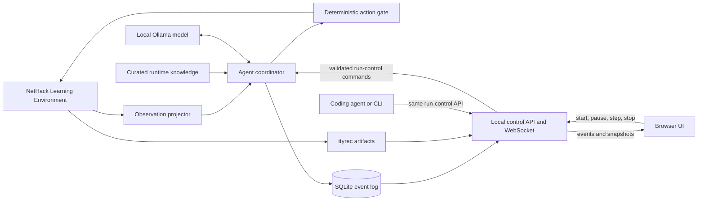

# Architecture

## Goal

Build a local, autonomous NetHack agent whose long-term success criterion is ascending with the Amulet of Yendor. Development and debugging may use online coding agents; gameplay must remain offline except for loopback communication with local services.

## Current status

The deterministic NLE adapter is implemented and covered by real-environment tests. It owns seeded Staircase setup, public zero-copy observations, legal-action validation, lifecycle state, and ttyrec finalization. The observation projector, structured Ollama decision model, flat single-action coordinator with a deterministic action gate, and SQLite run/event store are implemented; `smoke agent` exercises one real Ollama decision. Hierarchical goals and skills, the control API, and the web UI described below are not yet implemented.

## System context

## Component boundaries

### `nethack-agent/`

The product domain. It owns the Python application, local-model integration, NLE adapter, run data, web service, browser assets, evaluation suites, and compact knowledge supplied to the playing model. It can become a separate repository later without moving unrelated project history.

### NLE adapter

Use the maintained [`NetHack-LE/nle`](https://github.com/NetHack-LE/nle) package through its Gymnasium API. The first task is `NetHackStaircase-v0`; the eventual full-game environment is `NetHackScore-v0` or a narrowly derived environment if a proven requirement appears.

The adapter must:

- pin the NLE release and expose its version in run metadata;
- select a fixed beginner-friendly character, initially lawful dwarven Valkyrie (`val-dwa-law`);
- save every evaluated episode as ttyrec;
- use explicit seeds and deterministic time-derived effects when supported;
- expose only legitimate observations to the policy; NLE's internal task state must never enter a model prompt;
- translate model intent into the finite action set and reject invalid actions before calling `env.step`.

`NleEnvironment` implements the current boundary. One committed suite seed is
deterministically expanded into separate core, display, and level-generation
seeds; NLE reseeding is disabled and time-derived effects use the seed. The
adapter requests only public observation keys, represents its finite action set
as typed index/command/name records, and rejects invalid indices before NLE.

NLE reuses its NumPy observation buffers. `NleObservation` therefore exposes
zero-copy views that are valid only until the next `step` or `reset`. Consumers
must project or persist needed values before advancing the environment; they
must not retain raw observations as event history.

### Observation projector

`ObservationProjector` converts each ephemeral NLE observation into compact,
immutable state before the next environment call. It copies visible map
characters plus color and special bytes, all public bottom-line statistics,
decoded message and inventory strings, prompt flags, and changed map cells.
The result is JSON-serializable for prompts, persistence, APIs, and UI clients.
Map deltas are computed against the previous projection without retaining NLE
buffers. Raw arrays do not cross this boundary.

### Agent coordinator

A state machine, not an open-ended chat loop. It owns run lifecycle (`idle`, `running`, `paused`, `terminal`), current goal, active skill, prompt cadence, inference retries, and action execution. The local model chooses goals or skills. Deterministic code performs prompt handling, validates actions, and executes routine low-level steps where a skill defines them.

If Ollama times out, emits malformed structured output, or proposes no legal action, the coordinator performs one schema-repair retry. A second failure pauses the run, persists diagnostics, and waits for operator resume or stop. It must not silently substitute another policy.

`OllamaDecisionModel` implements the model boundary. It sends the projected
observation and the legal action table to Ollama with the `DECISION_SCHEMA`
JSON schema as the structured output format, thinking disabled, temperature 0,
and a 512-token cap. `parse_action_decision` requires a goal, one to five unique
legal candidates with scores in [0, 1], a selected legal action that is among
the candidates with the highest score, and a bounded rationale. A transport or
validation failure triggers exactly one repair prompt that includes the error;
a second failure raises `DecisionFailure`. Reported metrics sum tokens and
latency across both attempts.

`AgentCoordinator` is the current, flat implementation: the model selects one
NLE action per step; goals and skills are not yet separate layers. States are
`idle`, `running`, `paused`, `terminal`, `stopped`, and `error`. `start` resets
NLE into `paused`; `advance` performs one decision and action while `running`,
or one single step while `paused`. Model inference runs outside the lock, so
pause or stop during inference discards the pending decision. The action gate
rejects an index outside the legal action table and pauses the run.
`DecisionFailure` pauses with the error recorded; an NLE failure moves the run
to `error`. Truncation, death, and task success are terminal and close NLE,
finalizing the ttyrec.

### Knowledge layers

Two audiences require separate material:

1. `_agents/skills/` contains tools and procedures for online coding agents working on the repository. These may inspect the ignored NetHackWiki dump and produce reviewed project changes.
2. `nethack-agent/knowledge/` contains concise, versioned, cited facts suitable for retrieval into the local playing model's context.

The 188 MB wiki XML dump is source material, not a runtime prompt and not committed. Automatic extraction must not become trusted gameplay knowledge without review. Policy, prompts, and knowledge remain fixed throughout an evaluation suite; there is no online self-modification in milestone 1.

### Persistence and replay

SQLite is the authoritative structured event log. Every run will record configuration and version identifiers, seeds, projected observations, goals, candidate actions and scores, chosen action, concise rationale, inference timing and token counts, rewards, errors, and terminal outcome. Large binary arrays should not be duplicated in every event. NLE ttyrec files provide native episode replay and are referenced from the run record.

`RunStore` implements this log in `<data-dir>/runs.sqlite3` (WAL mode). The
`runs` table holds scenario configuration, derived seeds, environment,
character, model, policy, knowledge, NLE and Ollama versions, state, outcome,
last error, and the ttyrec path. The `events` table holds per-run JSON payloads
with contiguous sequence numbers starting at 0. Each run's NLE artifacts live
under `<data-dir>/runs/<run-id>/`.

### Control and observation surface

A local Python service will expose a client-neutral HTTP control/status API and
stream events over WebSocket. Both the browser UI and coding-agent tools use
this API; neither communicates with the coordinator directly. A coding agent
can therefore launch the service, start a run for a specific task and seed,
observe it, pause or single-step it, and stop it after collecting evidence.

Run creation accepts a typed, validated scenario configuration rather than an
arbitrary command: environment/task, seed, step cap, and versioned policy,
model, and knowledge settings. Lifecycle commands are serialized through the
coordinator state machine. Stop is idempotent and graceful: close NLE, flush
SQLite events, finalize the ttyrec reference, then report the terminal state.

The first browser UI must show the floor map, player statistics, inventory,
messages, current goal, candidate actions, chosen action, concise rationale,
latency, and run status. Controls: start, pause, single-step, and stop. It
displays structured decision traces, not hidden chain-of-thought.

The service binds to loopback by default and the same control contract must be
usable without a browser. A coding-agent-orchestrated scenario is a development
run, not a valid offline evaluation episode; evaluation suites are launched and
executed without online intervention.

## Runtime constraints

- Python 3.12 and `uv` manage the application environment.
- NLE 1.3.0 is pinned initially. It supports Python 3.10–3.13, Gymnasium 1.2.0, NetHack 3.6.7, ttyrec output, and the required observations.
- Ollama is the only model transport in gameplay. The baseline model is `gemma4-nethack:latest`, configurable without code changes.
- Gameplay must not call cloud APIs, the public web, or remote model endpoints. Configuration rejects non-loopback Ollama URLs.
- The current RTX 4070 Laptop GPU has 8 GB VRAM while the selected model occupies about 9.6 GB on disk. Partial CPU offload is expected; inference latency must be measured before setting action cadence.

## Evaluation contract: milestone 1

Milestone 1 is complete only when all of the following hold:

- `NetHackStaircase-v0`, fixed lawful dwarven Valkyrie;
- a committed suite of 10 deterministic seeds;
- task success on at least 6 seeds, including seed 6;
- no invalid action reaches NLE;
- each episode has complete SQLite decision events and a ttyrec reference;
- gameplay makes no non-loopback network call;
- the UI remains responsive and its start, pause, step, and stop controls work;
- prompts, policy, model identifier, and knowledge version are fixed for the entire suite.

A successful Staircase episode means the agent stands on a down staircase, matching NLE's task termination condition; descending is not required.

## Deferred decisions

- Laya or another small decision model may become a reflex or candidate-ranking layer only after the Gemma baseline produces action-level latency and error data.
- A source fork or submodule of NLE is deferred until a required engine change cannot be implemented cleanly through the public API.
- Automatic episodic memory, online prompt mutation, and policy training are outside milestone 1 because they undermine reproducibility and are unlikely to help the current local model without an explicit learning design.
