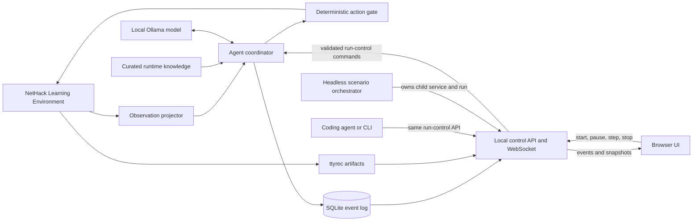

# Architecture

## Goal

Build a local, autonomous NetHack agent whose long-term success criterion is ascending with the Amulet of Yendor. Development and debugging may use online coding agents; gameplay must remain offline except for loopback communication with local services.

## Current status

The deterministic NLE adapter, immutable observation projector, hierarchical goal/skill coordinator with per-level terrain memory, deterministic staircase navigation and level exploration, and an action gate, structured Ollama decision model, reviewed local knowledge bundle, typed SQLite event log, loopback HTTP/WebSocket control service with the dependency-free browser UI, headless scenario orchestrator, executable socket-boundary verifier, and the committed 10-seed evaluation suite with its `eval run` and `eval abort` harness are implemented. Milestone 1 is accepted: the first complete real-model suite run of policy `hierarchical-explore-v1` passed with 10/10 task successes (`nethack-agent/evaluation/reports/staircase-v1-20260926T211301Z.json`). With the current `staircase-reviewed-v2` knowledge bundle and explicit `autoopen`, the same suite and model passed again with 10/10 and step-identical trajectories (`nethack-agent/evaluation/reports/staircase-v1-20260927T065500Z.json`).

## System context

## Component boundaries

### `nethack-agent/`

The product domain. It owns the Python application, local-model integration, NLE adapter, run data, web service, browser assets, evaluation suites, and compact knowledge supplied to the playing model. It can become a separate repository later without moving unrelated project history.

### NLE adapter

Use the maintained [`NetHack-LE/nle`](https://github.com/NetHack-LE/nle) package through its Gymnasium API. The first task is `NetHackStaircase-v0`; the eventual full-game environment is `NetHackScore-v0` or a narrowly derived environment if a proven requirement appears.

The adapter must:

- pin the NLE release and expose its version in run metadata;
- select a fixed beginner-friendly character, initially lawful dwarven Valkyrie (`val-dwa-law`);
- save every evaluated episode as ttyrec;
- use explicit seeds and deterministic time-derived effects when supported;
- expose only legitimate observations to the policy; NLE's internal task state must never enter a model prompt;
- translate model intent into the finite action set and reject invalid actions before calling `env.step`.

`NleEnvironment` implements the current boundary. One committed suite seed is
deterministically expanded into separate core, display, and level-generation
seeds; NLE reseeding is disabled and time-derived effects use the seed. The
adapter requests only public observation keys, explicitly adds `autoopen` to
NLE's option list rather than relying on NetHack's default, represents its
finite action set as typed index/command/name records, and rejects invalid
indices before NLE.

NLE reuses its NumPy observation buffers. `NleObservation` therefore exposes
zero-copy views that are valid only until the next `step` or `reset`. Consumers
must project or persist needed values before advancing the environment; they
must not retain raw observations as event history.

### Observation projector

`ObservationProjector` converts each ephemeral NLE observation into compact,
immutable state before the next environment call. It copies visible map
characters plus glyph IDs (`glyph_rows`), color, special bytes, and an explicit
per-cell pet mask (`pet_rows`) derived only from NLE's pet-glyph identity. Map
display characters use stable glyph identities to render boulders as `0` and
the ghost monster class as `X`; the original glyph IDs, NetHack colors, and
player cell rendering remain authoritative. The projection also includes all
public bottom-line statistics, decoded message and inventory strings, prompt
flags (`single_character_choice` for single-character prompts, `text_input`,
and `wait_for_space`), and changed map cells with their updated glyph,
character, and pet data. NLE exposes inventory glyph, letter, object-class, and
description arrays but no BUC array. The projector therefore derives a typed
`BucStatus` only from an exact leading `blessed`, `uncursed`, or `cursed`
adjective after an article or stack count; every other description is
`unknown`. The result is JSON-serializable for prompts, persistence, APIs, and
UI clients. Map deltas are computed against the previous projection without
retaining NLE buffers. Raw arrays do not cross this boundary.

Every new projection records pet evidence. Observations persisted before pet
evidence existed (including the accepted milestone 1 suite) have no `pet_rows`
or changed-cell `pet`; they load with pet evidence *unknown* (`pet_rows: None`,
`pet: None`, serialized as JSON `null`), never as an invented all-zero mask.
Present pet fields are still strictly validated (hex rows of the map shape with
0/1 bytes; boolean `pet`), and unknown extra fields are rejected. The browser
highlights no pet when evidence is unknown.

Inventory observations stored before `buc` existed load as `unknown`; the
reader never reparses their description and invents evidence. Present values
must be one of the four enum states. This follows the same evidence rule as
legacy pet observations.

### Agent coordinator

A state machine, not an open-ended chat loop. It owns run lifecycle (`idle`,
`running`, `paused`, `terminal`, `stopped`, and `error`), current goal, active
skill, model cadence, inference retries, and action execution. `Skill` is an
enum; `SkillDecision`, `ActionDecision`, `ActionSelection`, and their metrics
are immutable typed records. Goals are the typed `traversal.Goal` union
([ADR 0004](docs/decisions/0004-traversal-goals-and-task-progression.md)):
`stand_on_stairs` or `traverse_stairs`, each with a `StairTarget` (direction
`up`/`down` and connection `any`, `main`, or `branch` with a dungeon number).
They persist as objects such as
`{"kind": "stand_on_stairs", "target": {"direction": "down", "connection": "any", "dungeon_number": null}}`;
the string `stand_on_downstairs` stored before typed goals reads as exactly that
goal. The model is offered goals by token (`stand_on_stairs:down:any`) through
a per-call generation schema, and the parser maps a token back to the offered
goal. The current goal is still fixed to stand on any `>` without issuing the
descend command; traversal goals, stair identity, and level changes follow the
rest of ADR 0004.

Model role ([ADR 0002](docs/decisions/0002-deterministic-skill-arbiter.md)):
a deterministic arbiter, not the local model, chooses the executing skill on
every step. The model's start-of-episode goal and skill decision is recorded
but cannot override the arbiter. Its choice is binding only in a stuck
consultation, and it supplies actions only for unhandled prompts and stuck
fallbacks. Later milestones should return genuinely contextual choices to the
model: resource/risk trade-offs before descending, prayer or recovery,
high-priority threats, and branch plans. During a fixed episode it may handle
an unfamiliar state but cannot modify the policy. Between runs or suites,
coding agents review persisted evidence and either revise reviewed knowledge
or implement a deterministic skill for a simple recurring case.

`AgentCoordinator` consults the model for goal and skill at the start of an
episode. A deterministic arbiter then owns skill switching on every step:
`staircase_navigation` whenever a remembered downstairs is reachable, otherwise
`explore_level`. The start decision is recorded but cannot override the
arbiter. Per step, in order:

1. a pending direction prompt from exploration's own kick is answered;
2. `SafePromptHandler` acknowledges wait-for-space prompts, cancels text input
   with an empty response, and declines recognizable yes/no prompts (which
   includes "Really attack?" for peaceful monsters);
3. any other prompt goes to the model as a fallback action;
4. `StaircaseNavigationSkill` routes to the reachable remembered `>` with the
   shortest breadth-first route; equal distances choose the topmost, then
   leftmost coordinate. If already standing on any remembered `>`, it waits.
   It steps straight onto the chosen `>` when adjacent and otherwise first
   fights an adjacent hostile. It does not model staircase identity or route
   upward;
5. `ExploreLevelSkill` acts, or reports a typed `StuckReason`.

Both skills route over `navigation.LevelMemory`, a coordinator-owned,
per-level record bounded by the 21x79 map. It remembers the last terrain glyph
of every cell (NetHack draws the hero, monsters, and objects over terrain), the
cells the hero has been adjacent to, search coverage, learned blocked moves,
locked doors, kicks, peaceful monster glyphs, abandoned goals, and a short
position history. It resets on `start` and whenever the dungeon level changes.
Breadth-first routes follow NetHack 3.6.7 `test_move`: no diagonal move into or
out of an open or closed door (doorless and broken doorways allow diagonals),
closed doors are entered orthogonally because moving into one opens it,
diagonal squeezes between rock are allowed for the medium-sized, lightly loaded
hero, and boulders and known traps are never routed through. Visible non-pet
monsters block routes; pets are displaced. Explicit refusal messages ("It's a
wall.", diagonal-door refusals) block an edge for the level; three unexplained
failed moves only mark it suspect.

`ExploreLevelSkill` first attacks an adjacent displayed monster unless it is a
pet, answered a "Really attack?" prompt, or is on a passive-damage list
(floating eye, gas spore, molds, jellies); NLE's Staircase action set has no
fight command, so it moves into the monster. It then walks to the nearest
reachable frontier, a known cell next to never-observed blank space, with
doorways and corridors winning distance ties and a remembered but unreachable
`>` biasing the choice toward it. A frontier reachable only past a monster is
approached, fought, or waited on (bounded). With no frontier it kicks a known
locked door that leads into unexplored space, only on dungeon level 1, where no
shopkeeper or watch exists. Otherwise it searches: candidate spots are room
cells beside straight walls and corridor dead ends, scored by never-observed
cells near the walls or rock they cover minus twice the travel distance; each
adjacent cell counts until searched 10 times per round, and the chosen spot
stays committed until spent. Routing that dithers among at most six cells for
12 moves, or 100 routed moves without new knowledge, abandons the goal until
the map changes. When no spot remains the skill reports `search_exhausted` (or
`monster_blocked`).

A stuck report triggers a model skill consultation, at most once per 20 stuck
steps. Choosing `explore_level` re-arms exploration (a new search round, cleared
suspect edges and abandoned goals); choosing `staircase_navigation`, or a
re-armed exploration that still cannot act, yields a model fallback action.

Every proposal passes through `ActionGate`. It verifies the finite action index
table and rejects `MiscDirection.UP` and `MiscDirection.DOWN`
(`decision.FORBIDDEN_ACTION_NAMES`), even when proposed by the model, before
NLE can receive them: the task never changes level. `<` on dungeon level 1 asks
to leave the dungeon; NLE's default prompt handling declines that question
(see ADR 0004), and the gate still forbids the action. A step records its typed
goal and executed skill, the action source (`deterministic_skill`,
`deterministic_prompt`, or `model_fallback`), who selected the skill (`arbiter`
or, after a stuck report, `model`), the stuck reason if any, the skill's map
intent, and the applicable structured model decisions and metrics. A
model-selected skill must match the step's model skill decision. This is an
auditable decision trace, not chain-of-thought.

The map intent (`decision.ActionIntent`) comes from the deterministic skill's
own routing data, never from the action direction or rationale text. It has an
optional `destination` with a `DestinationKind` and zero-based map
coordinates, and an optional `attack_target` cell; at least one is present:

- `downstairs`: the remembered `>` staircase navigation routes to, steps onto,
  waits on, or keeps while it first fights an adjacent hostile;
- `frontier`: exploration's route goal next to never-observed space, including
  when the route first opens a door or waits for or attacks a blocking monster;
- `search_spot`: the committed spot exploration walks to and searches from;
- `locked_door`: the door exploration walks beside, kicks, and aims its kick
  at;
- `attack_target`: the displayed hostile monster the action attacks by moving
  into it. Exploration fights before choosing a frontier, so its attacks carry
  no destination.

The destination is usually not the adjacent cell the action steps into.

The intent's optional `path` is the route the action follows, as computed by
the skill's breadth-first `RouteTree` for this step: the ordered cells after
the hero's position, starting with the cell the action moves into and ending at
the destination (for a locked door, at the cell orthogonally beside it where
the hero kicks). The skill takes its move from this same route, so the path is
never recomputed for display. Skills replan every step; there is no persistent
multi-step plan. The path is `null` when the action follows no route: waiting
on `>`, waiting for a peaceful or passive blocker, searching in place,
kicking, and adjacent-hostile defense (the route to the destination is not
taken on that step). A present path has 1 to 21 × 79 cells, needs a
destination, never revisits a cell, is king-move contiguous, ends as above,
starts at the attack target when both exist, and stays inside the observation
map.

Prompt answers and model fallbacks carry no intent; the contract rejects an
intent on any non-`deterministic_skill` selection. Recording the intent and
path does not change any action choice.

`OllamaDecisionModel` implements both model boundaries. Skill selection uses
`SKILL_DECISION_SCHEMA` with skill descriptions, the consultation reason, and,
when stuck, the visible map; ambiguous action fallback uses
`ACTION_DECISION_SCHEMA` and only gate-allowed actions, with at most three
candidates, 100-character candidate reasons, and 200-character rationales.
Both paths disable thinking, use temperature 0, a 512-token output cap, and an
explicit `num_ctx` (default 8,192, `NETHACK_AGENT_OLLAMA_NUM_CTX`). A reported
prompt that leaves less than 512 tokens of that window raises
`OllamaContextLimitError` as a failed attempt, because Ollama may have
truncated it silently. Both paths reject duplicate keys and malformed or
semantically invalid values, and perform exactly one schema-repair retry. A
second failure raises `DecisionFailure` with both attempt diagnostics, token
counts, measured client elapsed durations, and reported Ollama durations.
Aggregate latency uses Ollama `total_duration` when available and wall-clock
duration when a failure returns no generation metrics. Both prompts include the
same bounded reviewed-knowledge context. The explicit scripted development model
does not read or use knowledge; it always chooses `explore_level` and falls
back to waiting.

`start` resets NLE into `paused`; `advance` performs one hierarchical action
while `running`, or one single step while `paused`. An explicit in-flight
revision protocol allows only one advance to decide from an observation. Model
inference runs outside the lock, so pause or stop during inference invalidates
and discards the pending skill or action decision. Level memory folds in each
observation idempotently and learns from an action only after NLE executed it;
the one exception is a stuck re-arm chosen by the model, which is kept if a
pause then discards the step because it only widens the search budget.
`DecisionFailure` and
action-gate rejection pause with structured diagnostics; an unexpected model,
NLE, projection, or persistence failure moves the run to `error`, closes NLE,
and finalizes the ttyrec. Truncation, death, and task success are terminal and
also close NLE.

### Knowledge layers

Two audiences require separate material:

1. `_agents/skills/` contains tools and procedures for online coding agents working on the repository. These may inspect the ignored NetHackWiki dump and produce reviewed project changes.
2. `nethack-agent/knowledge/` contains concise, versioned, cited facts injected into the local playing model's context.

The 188 MB wiki XML dump is source material, not a runtime prompt and not committed. Automatic extraction must not become trusted gameplay knowledge without review. Policy, prompts, skills, model identity, and knowledge remain fixed throughout an evaluation suite; there is no online self-modification.

`knowledge.load_knowledge_bundle` reads only `knowledge/manifest.json` and the
direct Markdown cards it allowlists, in manifest order. The manifest pins each
card's SHA-256; the loader rejects missing, tampered, duplicate, escaping,
oversized, or malformed cards and requires canonical NetHackWiki sources,
retrieval date, reviewed dump path, version applicability, uncertainty, and
CC BY-SA 3.0 attribution. It renders only facts and non-goals, rejects context
above the manifest bound (at most 6,000 characters) or 1,500 estimated tokens,
and derives `<bundle_id>+sha256:<digest>` from the canonical manifest plus exact
card bytes. There is no runtime network access, raw-dump access, or dynamic
retrieval. `RunManager` loads one bundle at service construction and records
its version in every run; packaged wheels include the same directory. Explicit
scripted development runs record the service's bundle version for comparable
metadata but do not consume its prompt context.

The current `staircase-reviewed-v2` bundle makes scenario `autoopen` explicit,
records that NLE's one displayed glyph does not reveal stairs under a covering
object or monster, and documents the additional same-direction stairs at the
Gnomish Mines and Sokoban branch entrances from local-wiki evidence.

### Persistence and replay

SQLite is the authoritative structured event log. Every run will record configuration and version identifiers, seeds, projected observations, goals, candidate actions and scores, chosen action, concise rationale, inference timing and token counts, rewards, errors, and terminal outcome. Large binary arrays should not be duplicated in every event. NLE ttyrec files provide native episode replay and are referenced from the run record.

`RunStore` implements this log in `<data-dir>/runs.sqlite3` (WAL mode with
foreign keys enabled). Every per-operation SQLite connection is explicitly
closed. The `runs` table holds scenario configuration, derived seeds,
environment, character, model, policy, knowledge, NLE and Ollama versions, the
Ollama `num_ctx` (`ollama_num_ctx`; stores created before it existed gain the
column with `NULL` for older runs),
state, outcome, last error, and the ttyrec path. The `events` table holds
per-run JSON payloads with contiguous sequence numbers starting at 0. State
updates and their corresponding events commit in one transaction with
expected-state guards, so pause or stop cannot be overwritten by a late step.
Each run's NLE artifacts live in a unique episode directory below
`<data-dir>/runs/<run-id>/`.

The run manager records six discriminated event variants: `run_started`,
`run_resumed`, `run_paused`, `step`, `agent_error`, and `run_stopped`. Each
variant has an immutable dataclass payload and an `EventKind`; free-form event
kinds and payload dictionaries do not cross the store boundary. Serialization
occurs when SQLite writes an event, and every read strictly deserializes the
stored kind and exact payload shape. Unknown kinds, malformed JSON, duplicate
keys, invalid nested observations or decisions, and semantically inconsistent
step payloads fail with a clear stored-event contract error. HTTP and WebSocket
consumers receive the same stable `{sequence, created_at, kind, payload}` JSON
envelope. Step events include the action selection (source, goal, executed
skill, skill-selection source, stuck reason, rationale, and map `intent`),
optional model skill/fallback decisions and metrics, gated action, reward,
termination fields, outcome, and the projected observation. A present intent is
strictly validated (exact fields, a known destination kind, non-negative
integer cells inside the observation map, and the path rules above). Events
recorded before the `hierarchical-explore-v1` selection fields existed no
longer satisfy the strict reader; their evaluation reports remain the evidence
for those runs. Events recorded before pet evidence, map intents, or intent
paths existed, which include the accepted milestone 1 suite, remain readable
through the store, HTTP API, browser UI, and evaluation audit: pet evidence is
unknown, as described under the observation projector, an absent `intent`
reads as JSON `null` (no intent recorded), and an absent intent `path` reads as
`null` (no route recorded), never as an inferred target or route.
Inventory records written before typed BUC evidence remain readable in the
same way: absent `buc` becomes `unknown`, never a description-derived claim.

The exact-field construction helpers and domain parsers remain authoritative
instead of adding a second runtime JSON Schema validation pass; see
[ADR 0003](docs/decisions/0003-typed-contract-construction.md). Ollama's two
JSON Schemas constrain generation but do not replace domain parsing,
duplicate-key rejection, enum/dataclass construction, contextual errors, or
cross-field validation.

### Control and observation surface

A local Python service exposes a client-neutral HTTP control/status API and
streams events over WebSocket. Both the browser UI and coding-agent tools use
this API; neither communicates with the coordinator directly. A coding agent
can therefore launch the service, start a run for a specific task and seed,
observe it, pause or single-step it, and stop it after collecting evidence.

Run creation accepts validated run execution parameters (`seed`,
`max_episode_steps`, and `auto_start`) with strict types (`StrictInt` and
`StrictBool`, with `extra="forbid"`) rather than arbitrary command lines. The
environment (`NetHackStaircase-v0`), character (`val-dwa-law`), model
(`gemma4-nethack:latest`), policy, and knowledge settings are fixed by the
service configuration (environment variables and process defaults) rather than
accepted per request, ensuring uniform evaluation conditions across runs.
Lifecycle commands are serialized through the coordinator state machine. Stop
is idempotent and graceful: close NLE, flush SQLite events, finalize the ttyrec
reference, and report the terminal state without duplicating stop events on
repeated calls.

`nethack-agent serve` implements this service with FastAPI and uvicorn, managing
graceful shutdown through FastAPI's lifespan context (`manager.close`). It binds
only to loopback hosts (`127.0.0.1`, `localhost`, or literal IPv6 `::1`), with
`localhost` pinned specifically to `127.0.0.1`. Both `ControlClient` and
`OllamaClient` normalize endpoints to literal loopback addresses and bypass
HTTP proxies. `RunManager` owns at most one active run per process and ensures
that at most one worker advances it at a time.

- `GET /api/health`;
- `POST /api/runs` with strict typed payload (`seed` as `StrictInt`, optional
  `max_episode_steps` as `StrictInt` default 5000, and optional `auto_start` as
  `StrictBool` default false);
- `GET /api/runs/{id}` for the typed run record, coordinator snapshot with
  current observation, current goal and skill, and legal actions;
- `GET /api/runs/{id}/events?after=N&limit=M`, where `after` is an exclusive
  sequence cursor, `limit` is 1-1000 (default 100), and the response returns
  `events`, `next_after`, `has_more`, and `limit`;
- `POST /api/runs/{id}/pause`, `POST /api/runs/{id}/resume`,
  `POST /api/runs/{id}/step`, `POST /api/runs/{id}/stop`;
- `WS /api/runs/{id}/events/ws?after=N&limit=M`, which performs bounded history
  replay and live event streaming, offloads SQLite queries asynchronously to
  worker threads (`asyncio.to_thread`), and actively monitors client
  disconnection; it closes cleanly with code 1000 after the run reaches
  `terminal`, `stopped`, or `error`.

Unknown HTTP runs return 404 and unknown WebSocket runs close with code 4404.
Invalid lifecycle transitions and a second active run return 409; model
decision and action-gate failures return 503; coordinator invariant failures
return 500. The environment, character, model, policy, and knowledge versions
are fixed by the service configuration rather than per request. Run control
lives in memory: after a service restart, earlier runs remain readable but
cannot be controlled, and their stored state is not reconciled.
`ControlClient` and
`nethack-agent run start|status|pause|resume|step|stop|events` use this API from
the command line. `run` remains client-only and never owns the service.
`ControlClient` validates health, status, and event-page response shapes,
iterates every cursor page, applies finite monotonic readiness and state
deadlines, and reports malformed responses, timeouts, and unexpected paused,
terminal, stopped, or error states distinctly.

`nethack-agent scenario run` is the owning headless path. It accepts one strict
configuration with a positive seed and episode cap, a loopback host and valid
port, a finite timeout, a data directory, and exactly one of autonomous or
bounded-step execution. It launches the service as an argument-vector child
without a shell, waits for health, creates and drives the run, retrieves all
event pages, and then stops any active run before gracefully signaling and
reaping the child. The same cleanup runs on API failures, deadline expiry, and
interrupts. `--json` emits one machine-readable result. The existing `run`
commands intentionally remain usable against an independently managed service.

`--development-scripted-model` explicitly selects a deterministic no-Ollama
model for development checks. It is never selected as a fallback, is not
production gameplay, and does not produce a valid evaluation episode.

The browser UI is a dependency-free single page (plain HTML, CSS, and vanilla
JavaScript modules in `nethack_agent/ui/`, packaged in the wheel) served by the
same FastAPI app at `/` with assets under an allowlisted `/ui/{name}` route.
`app.js` owns run/API/stream state, `view.js` owns DOM selection, responsive
panel/tab behavior, path preference, focus, and tooltips, `event-log.js` owns
the four bounded logs, `render.js` owns pure DOM rendering, and `client.js`
owns HTTP/WebSocket transport. It uses only this HTTP API and the event
WebSocket through page-relative URLs, so
it works on any loopback host and port. It shows the NetHack-colored floor map,
highlights the player and explicitly observed pets separately from wild
animals, and displays boulders as `0` and ghost-class monsters as `X`. The map
also boxes the displayed step's recorded intent: a dashed accent box on the
destination and a solid danger-colored box on the attack target, and tints the
recorded path cells with a faint accent background and dotted underline. The
intent shown is the one recorded by the step event that carries the displayed
observation; a newer status snapshot shows none until its step event arrives.
Precedence per cell: the player highlight replaces everything; otherwise the
attack-target box wins over the destination box, which wins over the path
tint; the pet fill combines with any of them, and the NetHack foreground color
is kept. A **Show path** checkbox beside the legend (on by default, stored in
`localStorage` as `nethack-agent.showPath`) hides only the path tint and
redraws without refetching. A legend under the map explains the player, pet,
destination, attack-target, and path highlights with tooltips. Frontier
destinations use that destination box and their recorded routes use the path
tint; this visualization is delivered rather than roadmap work. Player
statistics use a specialized semantic description list: each `dt`/`dd` pair is
one responsive stat cell, arranged in three columns in the normal 50rem primary
column and automatically reduced to fewer columns if its container is
constrained. Conditions spans the full grid. This compact display keeps every
field, the separate Strength, Dexterity, Constitution, Intelligence, Wisdom,
and Charisma labels, and their focusable tooltips. The UI also shows inventory,
message, prompt flags, current goal and skill, run state, outcome, last error,
and decision metrics.
Every inventory item has a visible `[B]`, `[U]`, `[C]`, or `[?]` marker, a
matching accessible class and tooltip, and the inventory panel includes the
same textual legend, so color is not the only BUC cue.
A full-width control panel sits above three workspace columns: the 50rem first
column contains run information, the fixed 79-by-21 map, and player state; the
30rem second column contains inventory; and the third column consumes the
remaining width (at least 24rem) for metrics and agent information. When the
viewport is 1520 CSS px wide or narrower (the 107rem three-column layout at the
14 px root size plus room for a vertical scrollbar), the third column is hidden
behind an accessible Agent info control and opens as an overlay over the other
workspace columns.

Agent information has Events, Messages, Tools, and Verbose tabs. Each tab has an
independent auto-scroll control and scrolling body. Event rows are native
expand/collapse details; each newly received step becomes the one decision
expanded by default and exposes the selection, recorded intent and path (or
"none recorded"), model decisions, candidates, executed action, reward, and
outcome.
Messages lists one plain-text row, with observation step and event sequence, per
`run_started` or `step` event whose `observation.message` is non-blank after
trimming; repeated messages are kept because NetHack repeats them.
Tools contains expandable rows only for step events whose typed
`selection.source` is `deterministic_skill` or `deterministic_prompt` and whose
executed `action` is present; it does not infer tool calls. Verbose groups the
remaining game messages, concise rationales, candidate reasons, and
decision-attempt errors, but deliberately does not expose raw model responses
or hidden chain-of-thought. Focusable, semantic tooltips explain displayed
fields, map legend entries, the recorded intent, and the exact `Goal` and
`Skill` enum values. They are fixed-position layers placed through CSSOM custom
properties, so scrolling tab bodies and overflow-clipped panels cannot clip
them, and Escape dismisses a shown tooltip before closing the overlay. Live
renders keep unchanged tooltip DOM and restore focus to the same trigger when
values change.

Controls start a run (seed, episode cap, auto start), attach to an existing run
id (also via `#run=<id>`), and pause, resume, single-step, or stop it; API error
details are displayed. Attaching locates the newest event with O(log n)
single-event page probes and replays only the last 50 events. The stream
reconnects with backoff from the last delivered sequence after abnormal closure
and stops after a 1000 (finished run) or 4404 close. UI responses carry a
same-origin-only Content-Security-Policy with no inline script or style, and all
model and game text is inserted as text, never parsed as HTML. It displays
structured decision traces, not hidden chain-of-thought.

The service binds to loopback by default and the same control contract must be
usable without a browser. A coding-agent-orchestrated scenario is a development
run, not a valid offline evaluation episode; evaluation suites are launched and
executed without online intervention.

## Runtime constraints

- Python 3.12 and `uv` manage the application environment.
- NLE 1.3.0 is pinned initially. It supports Python 3.10–3.13, Gymnasium 1.2.0, NetHack 3.6.7, ttyrec output, and the required observations.
- Ollama is the only model transport in gameplay. The baseline model is `gemma4-nethack:latest`, configurable without code changes.
- Gameplay must not call cloud APIs, the public web, or remote model endpoints. Configuration rejects non-loopback Ollama URLs.
- `nethack-agent verify network` behaviorally enforces this boundary. During a
  real HTTP-controlled NLE step it replaces socket `connect`/`connect_ex` with
  a recording guard, blocks non-loopback literal destinations before the
  connection, and points HTTP proxy variables at a non-loopback sentinel. The
  verifier uses only the explicit scripted development model, requires observed
  loopback connections, and fails on any non-loopback attempt without
  contacting Ollama.
- The current RTX 4070 Laptop GPU has 8 GB VRAM while the selected model occupies about 9.6 GB on disk. With the Modelfile's 131,072-token default context, Ollama placed it 64% CPU / 36% GPU and the first suite attempt ran at about 6 s per step. With `num_ctx` 8,192, `ollama ps` reports 3.2 GB, 100% GPU. Under policy `hierarchical-staircase-v1`, fallback decisions (up to five candidates, 240-character reasons) measured p50 6.4 s and p95 9.5 s. With at most three candidates and shorter bounds, a warm fallback on seed 1 took 3.1–3.7 s (about 171 output tokens) and a skill consultation about 0.9–1.4 s (about 48 output tokens). Under `hierarchical-explore-v1`, deterministic skills choose almost every action. The complete real-model suite took 34 s with knowledge v1, and 39 s with knowledge v2, whose skill prompts carry about 195 more tokens (latency p50 1.1 s, maximum 1.6 s).

## Evaluation contract: milestone 1

Milestone 1 is complete only when all of the following hold. It was accepted on
2026-09-27 by `nethack-agent/evaluation/reports/staircase-v1-20260926T211301Z.json`:
10/10 task successes including seed 6, zero invalid actions and gate
rejections, and complete records. The knowledge-v2 rerun
(`nethack-agent/evaluation/reports/staircase-v1-20260927T065500Z.json`) met
the same gate. The network boundary is covered by `verify network`, and the
browser UI controls by `tests/test_ui.py` and a headless-browser check.

- `NetHackStaircase-v0`, fixed lawful dwarven Valkyrie;
- a committed suite of 10 deterministic seeds;
- task success on at least 6 seeds, including seed 6;
- no invalid action reaches NLE;
- each episode has complete SQLite decision events and a ttyrec reference;
- gameplay makes no non-loopback network call;
- the UI remains responsive and its start, pause, step, and stop controls work;
- prompts, policy, model identifier, and knowledge version are fixed for the entire suite.

A successful Staircase episode means the agent stands on a down staircase, matching NLE's task termination condition; descending is not required.

### Evaluation harness

`nethack-agent/evaluation/staircase-v1.json` is the committed milestone suite:
suite seeds 1–10 (chosen before any suite episode ran), a 1,000-step episode
cap, and acceptance of at least 6 task successes with seed 6 among them, zero
invalid NLE actions, zero action-gate rejections, and complete SQLite and ttyrec
records. `evaluation.load_suite` rejects unknown fields, any seed count other
than 10, duplicate seeds, a suite without seed 6, and an environment or
character other than the adapter's.

`nethack-agent eval run` drives each seed in-process through one `RunManager`
with `create_run(auto_start=True)`: the same coordinator, worker loop, action
gate, SQLite store, and ttyrec capture as the HTTP service, without HTTP or
child-process failure modes during multi-hour runs. The manager, Ollama
configuration, knowledge bundle, and policy version are created once for the
suite. The evaluator never resumes or steers an episode. A run that pauses after
a decision failure or gate rejection is stopped and scored by its recorded
outcome. Production mode first verifies that the configured local Ollama model
is ready.

After each seed the evaluator reads the complete event log back from SQLite. It
audits contiguous sequences starting with `run_started`, contiguous step
indices, a final event that matches the final state, nothing after the terminal
step, the suite seed and step cap, an existing nonempty ttyrec, and every
stepped action against the recorded legal-action table and the gate's
forbidden `MiscDirection.UP`/`MiscDirection.DOWN` actions. It
reports outcome, steps, wall time, model decisions (including failed and
repaired decisions), nearest-rank p50/p95/max decision latency, token totals,
selection-source counts, gate rejections, and invalid actions. Gate rejections
are `agent_error` events in the `paused` state without a decision-failure trace;
only decision failures and gate rejections pause the coordinator.

Acceptance also requires every suite seed to be evaluated without
interruption, an identical run configuration across seeds (model, policy,
knowledge, NLE version, environment, character, step cap, and
`ollama_num_ctx`), and unchanged suite and knowledge files at the end.
`--seeds` may reorder execution; a subset
produces a `partial` report that cannot pass. `--development-scripted-model`
reports are never milestone evidence. Each invocation reserves a new
timestamped JSON and Markdown report pair with exclusive creation and rewrites
only that pair, world-readable (0644), after every seed.

Report schema version 2 records a typed `status` (`running`, `complete`,
`partial`, `failed`, `interrupted`, or `aborted`) and an optional
`status_reason`. The Markdown is rendered purely from the JSON payload, so a
stored report can be re-rendered. `nethack-agent eval abort --report <json>
--reason <text>` finalizes a `running` or `interrupted` report whose suite the
operator will not finish, for example because the policy is being replaced:
it keeps every recorded result, aggregate, and acceptance value verbatim, sets
status `aborted` with the reason, rewrites both files in place, and never
creates or deletes files. Aborted reports are never accepted.

## Deferred decisions

- Laya or another small decision model may become a reflex or candidate-ranking layer only after the Gemma baseline produces action-level latency and error data.
- A source fork or submodule of NLE is deferred until a required engine change cannot be implemented cleanly through the public API.
- Automatic episodic memory, online prompt mutation, and policy training are outside milestone 1 because they undermine reproducibility and are unlikely to help the current local model without an explicit learning design.
