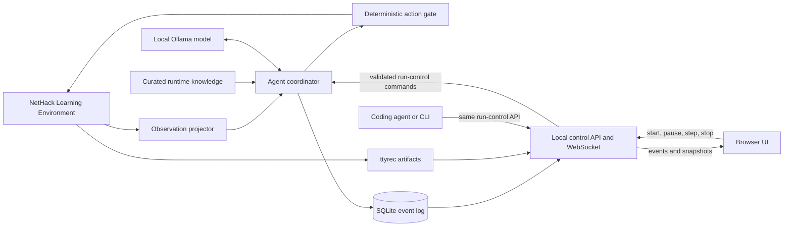

# Architecture

## Goal

Build a local, autonomous NetHack agent whose long-term success criterion is ascending with the Amulet of Yendor. Development and debugging may use online coding agents; gameplay must remain offline except for loopback communication with local services.

## Current status

The deterministic NLE adapter, observation projector, flat single-action coordinator with a deterministic action gate, structured Ollama decision model, SQLite run/event store, and loopback HTTP/WebSocket control service with a CLI client are implemented. Tests use real NLE environments and scripted models; `smoke agent` exercises one real Ollama decision. Hierarchical goals and skills, curated knowledge cards, the browser UI, and the evaluation suite are not yet implemented.

## System context

## Component boundaries

### `nethack-agent/`

The product domain. It owns the Python application, local-model integration, NLE adapter, run data, web service, browser assets, evaluation suites, and compact knowledge supplied to the playing model. It can become a separate repository later without moving unrelated project history.

### NLE adapter

Use the maintained [`NetHack-LE/nle`](https://github.com/NetHack-LE/nle) package through its Gymnasium API. The first task is `NetHackStaircase-v0`; the eventual full-game environment is `NetHackScore-v0` or a narrowly derived environment if a proven requirement appears.

The adapter must:

- pin the NLE release and expose its version in run metadata;
- select a fixed beginner-friendly character, initially lawful dwarven Valkyrie (`val-dwa-law`);
- save every evaluated episode as ttyrec;
- use explicit seeds and deterministic time-derived effects when supported;
- expose only legitimate observations to the policy; NLE's internal task state must never enter a model prompt;
- translate model intent into the finite action set and reject invalid actions before calling `env.step`.

`NleEnvironment` implements the current boundary. One committed suite seed is
deterministically expanded into separate core, display, and level-generation
seeds; NLE reseeding is disabled and time-derived effects use the seed. The
adapter requests only public observation keys, explicitly adds `autoopen` to
NLE's option list rather than relying on NetHack's default, represents its
finite action set as typed index/command/name records, and rejects invalid
indices before NLE.

NLE reuses its NumPy observation buffers. `NleObservation` therefore exposes
zero-copy views that are valid only until the next `step` or `reset`. Consumers
must project or persist needed values before advancing the environment; they
must not retain raw observations as event history.

### Observation projector

`ObservationProjector` converts each ephemeral NLE observation into compact,
immutable state before the next environment call. It copies visible map
characters plus glyph IDs (`glyph_rows`), color, and special bytes, all public
bottom-line statistics, decoded message and inventory strings, prompt flags
(`single_character_choice` for single-character prompts, `text_input`, and
`wait_for_space`), and changed map cells with their updated glyph and character
data. The result is JSON-serializable for prompts, persistence, APIs, and UI
clients. Map deltas are computed against the previous projection without
retaining NLE buffers. Raw arrays do not cross this boundary.

### Agent coordinator

A state machine, not an open-ended chat loop. It owns run lifecycle (`idle`, `running`, `paused`, `terminal`), current goal, active skill, prompt cadence, inference retries, and action execution. The local model chooses goals or skills. Deterministic code performs prompt handling, validates actions, and executes routine low-level steps where a skill defines them.

If Ollama times out, emits malformed structured output, or proposes no legal action, the coordinator performs one schema-repair retry. A second failure pauses the run, persists diagnostics, and waits for operator resume or stop. It must not silently substitute another policy.

`OllamaDecisionModel` implements the model boundary. It sends the projected
observation and the legal action table to Ollama with the `DECISION_SCHEMA`
JSON schema as the structured output format, thinking disabled, temperature 0,
and a 512-token cap. `parse_action_decision` requires a goal, one to five unique
legal candidates with scores in [0, 1], a selected legal action that is among
the candidates with the highest score, strict JSON integer action indices, no
duplicate object keys, and bounded text fields. A transport or validation
failure triggers exactly one repair prompt that includes the error; a second
failure raises a structured `DecisionFailure` retaining both attempt errors,
available final response text, token counts, measured client elapsed durations,
and reported Ollama durations. Aggregate latency uses Ollama `total_duration`
when available and wall-clock duration when a failure returns no generation
metrics.

`AgentCoordinator` is the current, flat implementation: the model selects one
NLE action per step; goals and skills are not yet separate layers. States are
`idle`, `running`, `paused`, `terminal`, `stopped`, and `error`. `start` resets
NLE into `paused`; `advance` performs one decision and action while `running`,
or one single step while `paused`. An explicit in-flight revision protocol
allows only one advance to decide from an observation. Model inference runs
outside the lock, so pause or stop during inference invalidates and discards
the pending decision. The action gate rejects an index outside the legal action
table and pauses the run. `DecisionFailure` pauses with structured diagnostics;
an unexpected model, NLE, projection, or persistence failure moves the run to
`error`, closes NLE, and finalizes the ttyrec. Truncation, death, and task
success are terminal and also close NLE.

### Knowledge layers

Two audiences require separate material:

1. `_agents/skills/` contains tools and procedures for online coding agents working on the repository. These may inspect the ignored NetHackWiki dump and produce reviewed project changes.
2. `nethack-agent/knowledge/` contains concise, versioned, cited facts suitable for retrieval into the local playing model's context.

The 188 MB wiki XML dump is source material, not a runtime prompt and not committed. Automatic extraction must not become trusted gameplay knowledge without review. Policy, prompts, and knowledge remain fixed throughout an evaluation suite; there is no online self-modification in milestone 1.

### Persistence and replay

SQLite is the authoritative structured event log. Every run will record configuration and version identifiers, seeds, projected observations, goals, candidate actions and scores, chosen action, concise rationale, inference timing and token counts, rewards, errors, and terminal outcome. Large binary arrays should not be duplicated in every event. NLE ttyrec files provide native episode replay and are referenced from the run record.

`RunStore` implements this log in `<data-dir>/runs.sqlite3` (WAL mode with
foreign keys enabled). Every per-operation SQLite connection is explicitly
closed. The `runs` table holds scenario configuration, derived seeds,
environment, character, model, policy, knowledge, NLE and Ollama versions,
state, outcome, last error, and the ttyrec path. The `events` table holds
per-run JSON payloads with contiguous sequence numbers starting at 0. State
updates and their corresponding events commit in one transaction with
expected-state guards, so pause or stop cannot be overwritten by a late step.
Each run's NLE artifacts live in a unique episode directory below
`<data-dir>/runs/<run-id>/`.

The run manager records `run_started`, `run_resumed`, `run_paused`, `step`,
`agent_error`, and `run_stopped`. Step events include the decision, candidates,
metrics, action, reward, termination fields, outcome, and projected
observation. Event payloads are plain JSON objects; event kinds are not yet a
typed schema.

### Control and observation surface

A local Python service will expose a client-neutral HTTP control/status API and
stream events over WebSocket. Both the browser UI and coding-agent tools use
this API; neither communicates with the coordinator directly. A coding agent
can therefore launch the service, start a run for a specific task and seed,
observe it, pause or single-step it, and stop it after collecting evidence.

Run creation accepts validated run execution parameters (`seed`,
`max_episode_steps`, and `auto_start`) with strict types (`StrictInt` and
`StrictBool`, with `extra="forbid"`) rather than arbitrary command lines. The
environment (`NetHackStaircase-v0`), character (`val-dwa-law`), model
(`gemma4-nethack:latest`), policy, and knowledge settings are fixed by the
service configuration (environment variables and process defaults) rather than
accepted per request, ensuring uniform evaluation conditions across runs.
Lifecycle commands are serialized through the coordinator state machine. Stop
is idempotent and graceful: close NLE, flush SQLite events, finalize the ttyrec
reference, and report the terminal state without duplicating stop events on
repeated calls.

`nethack-agent serve` implements this service with FastAPI and uvicorn, managing
graceful shutdown through FastAPI's lifespan context (`manager.close`). It binds
only to loopback hosts (`127.0.0.1`, `localhost`, or literal IPv6 `::1`), with
`localhost` pinned specifically to `127.0.0.1`. Both `ControlClient` and
`OllamaClient` normalize endpoints to literal loopback addresses and bypass
HTTP proxies. `RunManager` owns at most one active run per process and ensures
that at most one worker advances it at a time.

- `GET /api/health`;
- `POST /api/runs` with strict typed payload (`seed` as `StrictInt`, optional
  `max_episode_steps` as `StrictInt` default 5000, and optional `auto_start` as
  `StrictBool` default false);
- `GET /api/runs/{id}` for the run record, coordinator snapshot with current
  observation, and legal actions;
- `GET /api/runs/{id}/events?after=N&limit=M`, where `after` is an exclusive
  sequence cursor, `limit` is 1-1000 (default 100), and the response returns
  `events`, `next_after`, `has_more`, and `limit`;
- `POST /api/runs/{id}/pause`, `POST /api/runs/{id}/resume`,
  `POST /api/runs/{id}/step`, `POST /api/runs/{id}/stop`;
- `WS /api/runs/{id}/events/ws?after=N&limit=M`, which performs bounded history
  replay and live event streaming, offloads SQLite queries asynchronously to
  worker threads (`asyncio.to_thread`), and actively monitors client
  disconnection; it closes cleanly with code 1000 after the run reaches
  `terminal`, `stopped`, or `error`.

Unknown HTTP runs return 404 and unknown WebSocket runs close with code 4404.
Invalid lifecycle transitions and a second active run return 409; model
decision and action-gate failures return 503; coordinator invariant failures
return 500. The environment, character, model, policy, and knowledge versions
are fixed by the service configuration rather than per request. Run control
lives in memory: after a service restart, earlier runs remain readable but
cannot be controlled, and their stored state is not reconciled.
`ControlClient` and
`nethack-agent run start|status|pause|resume|step|stop|events` use this API from
the command line.

The first browser UI must show the floor map, player statistics, inventory,
messages, current goal, candidate actions, chosen action, concise rationale,
latency, and run status. Controls: start, pause, single-step, and stop. It
displays structured decision traces, not hidden chain-of-thought.

The service binds to loopback by default and the same control contract must be
usable without a browser. A coding-agent-orchestrated scenario is a development
run, not a valid offline evaluation episode; evaluation suites are launched and
executed without online intervention.

## Runtime constraints

- Python 3.12 and `uv` manage the application environment.
- NLE 1.3.0 is pinned initially. It supports Python 3.10–3.13, Gymnasium 1.2.0, NetHack 3.6.7, ttyrec output, and the required observations.
- Ollama is the only model transport in gameplay. The baseline model is `gemma4-nethack:latest`, configurable without code changes.
- Gameplay must not call cloud APIs, the public web, or remote model endpoints. Configuration rejects non-loopback Ollama URLs.
- The current RTX 4070 Laptop GPU has 8 GB VRAM while the selected model occupies about 9.6 GB on disk. Partial CPU offload is expected; inference latency must be measured before setting action cadence.

## Evaluation contract: milestone 1

Milestone 1 is complete only when all of the following hold:

- `NetHackStaircase-v0`, fixed lawful dwarven Valkyrie;
- a committed suite of 10 deterministic seeds;
- task success on at least 6 seeds, including seed 6;
- no invalid action reaches NLE;
- each episode has complete SQLite decision events and a ttyrec reference;
- gameplay makes no non-loopback network call;
- the UI remains responsive and its start, pause, step, and stop controls work;
- prompts, policy, model identifier, and knowledge version are fixed for the entire suite.

A successful Staircase episode means the agent stands on a down staircase, matching NLE's task termination condition; descending is not required.

## Deferred decisions

- Laya or another small decision model may become a reflex or candidate-ranking layer only after the Gemma baseline produces action-level latency and error data.
- A source fork or submodule of NLE is deferred until a required engine change cannot be implemented cleanly through the public API.
- Automatic episodic memory, online prompt mutation, and policy training are outside milestone 1 because they undermine reproducibility and are unlikely to help the current local model without an explicit learning design.
