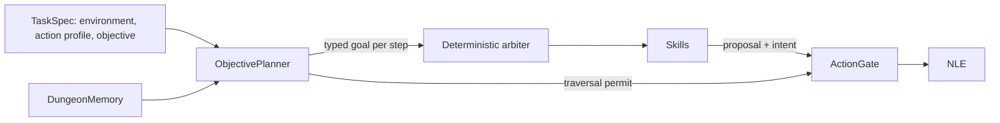

# ADR 0004: Typed traversal goals and staged NLE task progression

- Status: accepted (implementation in progress)
- Date: 2026-09-27
- Refines: [ADR 0002](0002-deterministic-skill-arbiter.md) (fixed goal,
  unconditional level-change ban) and applies
  [ADR 0003](0003-typed-contract-construction.md) to the new contracts

## Context

The coordinator has one goal, `Goal.STAND_ON_DOWNSTAIRS`.
`StaircaseNavigationSkill` routes to any remembered `>` and then waits there.
`LevelMemory` resets whenever `(dungeon_number, dungeon_level)` changes.
`ActionGate` rejects `MiscDirection.UP` and `MiscDirection.DOWN` everywhere.
The adapter hard-codes `NetHackStaircase-v0` and so gets NLE's
`TASK_ACTIONS`; the evaluator scores only NLE's binary task success. That was
enough for milestone 1. It blocks every roadmap task that needs a level change
or a metric-based result.

### NLE 1.3.0 facts

These come from `nle/env/tasks.py` and `nle/env/base.py` in the locked
environment. A read-only survey found them, and throwaway checks confirmed them.

- Only the Staircase family has a success end state (`TASK_SUCCESSFUL = 2`).
  Staircase succeeds on NLE's private `internal[4]` flag, which is set when the
  hero stands on the main `>` or on a down branch staircase. Oracle succeeds
  when the Oracle's glyph is in the 3x3 cells around the hero. Standing on `>`
  does not end an Oracle episode. Score, Scout, Gold and Eat end only on death
  or abort. Their rewards, each with an added time penalty, are:
  - Score: the score delta;
  - Scout: the number of newly non-blank glyphs, counted per
    `(DNUM, DLEVEL)`;
  - Gold: the gold delta;
  - Eat: any increase in the private `uhunger` value.
- Every task except Challenge uses `TASK_ACTIONS`. It has 23 actions and no
  PICKUP, PRAY, FIGHT, ESC or inventory-letter keys. `EAT` asks
  "What do you want to eat? [d or ?*]". The Valkyrie's food ration is `d`, which
  is not a legal key.
- NLE answers `--More--` itself and cancels text input. It also declines every
  yes/no prompt with ESC unless the message contains `eat`, `attack`,
  `direction?` or `pray` (`SKIP_EXCEPTIONS`).
- `NetHackGold` changes `pickup_types` to `$` only when `options` is `None`.
  The adapter always passes `NLE_OPTIONS`, so Gold runs with `$?!/`.
- `gym.make` puts `max_episode_steps` into `TimeLimit`, while NLE keeps its own
  5,000-step abort. With a 6,000-step cap, NLE aborted at step 5,000 with
  `end_status=-1`, and `_terminal_outcome` maps that to `error`. The API
  accepts caps up to 100,000.

### Baseline with the current policy

The worker ran the current policy with the scripted development model and a
2,000-step cap on Score, Scout, Gold, Eat and Oracle, seeds 1–5. Each seed's
trajectory is the same on all five tasks, because the policy never reads the
reward.

| Seed | Steps | End (all on DL1) | Steps waiting on `>` | First Hungry turn |
| ---: | ---: | --- | ---: | ---: |
| 1 | 558 | killed by a fox while waiting | 341 | — |
| 2 | 961 | killed by a newt while Fainting on `>` | 917 | 751 |
| 3 | 1,065 | starved, ration uneaten | 843 | 743 |
| 4 | 183 | killed by a fox while waiting | 136 | — |
| 5 | 1,042 | starved while fainted, ration uneaten | 0 | 731 |

- Why the waiting deaths happened: the wait branch
  (`skills.py` `StaircaseNavigationSkill`) runs before adjacent-hostile
  defense.
- Why seed 5 never found `>`: it lies under two food rations. The hero stood on
  it twice and saw "There is a staircase down here." Memory ignores that
  message, and it treats an object cell whose terrain it never saw as floor.
- Rewards:
  - Scout: 354, 262, 537, 220, 615;
  - Gold: 2, 0, −0.01, 0, 5.98;
  - Eat and Oracle: never above 0.
- No run had an unhandled prompt, a stuck report, or a model fallback.
- On Staircase, all five seeds succeed. Seed 5 succeeds only because NLE's
  private flag sees the covered `>`.

### Traversal probe

This throwaway script is not committed. It ran the current skills on
`NetHackScore-v0` with the adapter's seeds and options, and pressed `>` on
reaching any remembered `>`. It ran seeds 1–10, and some ascents on seeds 4
and 6.

- Pressing `<` at the DL1 start gave "Beware, there will be no return! Still
  climb? [yn] (n) n". NLE declined the prompt, and the level and episode
  continued.
- Descents:
  - There were 26 descents, and each raised `dungeon_level` by one.
  - After the hero stepped off, all 24 arrival cells that could be checked read
    cmap 23 (`<`).
  - In the Dungeons of Doom, `depth == dungeon_level`.
- Branch evidence:
  - Seeds 4 and 7 took a `>` on (0, 2) and arrived at (2, 1), depth 3. So the
    Gnomish Mines are dungeon 2, and their level numbering restarts at 1.
  - The branch staircases use the same cmap 24/23 as the main ones.
- Ascents:
  - All three ascents arrived on exactly the `>` that had been taken, including
    Mines (2, 1) to (0, 2).
  - NetHack then redrew the remembered map; for example, the non-blank cell
    count went from 46 to 528.
- Seed 8 reached (0, 3) before its first stair action, so levels can also change
  without stairs.
- 8 of the 10 seeds died within 361–1,043 steps.

### What the agent cannot know

- **Main or branch stairs.** NetHack 3.6.7 draws main and branch stairs with
  the same glyphs. The action set has no overview command, and `internal` is
  private. Before a lone `>` on DL2–4 is used, it cannot be classified.
- **Stairs under objects or monsters.** Such a staircase is known only from
  memory or from a look-here message.
- **Level changes without stairs.** Trap doors, holes and level teleports give
  no stair link.
- **Dungeon numbers other than 2.** They are inferred from the order in NLE's
  `nethackdir/dat/dungeon.def`: Dungeons of Doom 0, Gehennom 1, Mines 2,
  Quest 3, Sokoban 4, Ludios 5, Vlad's Tower 6, Planes 7.
- **Ladders and portals.** Ladders (cmap 25/26) exist only in Gehennom and
  Vlad's Tower, and stay floor. Portals are not stairs. Both are out of scope.

## Decision

### 1. Tasks, objectives, goals

A run executes one typed `TaskSpec`: an NLE task id, an action profile, and an
objective. A suite case or an API request selects the spec. The coordinator
then derives the goal for every step. The model does not supply it.



| Layer | Chosen by | Fixed for | Persisted in |
| --- | --- | --- | --- |
| Task spec | suite case or `POST /api/runs` | run | new `runs.task` column |
| Objective legs | task spec | run | inside `runs.task` |
| Goal | `ObjectivePlanner`, from objective, leg index and memory | step | `selection.goal` |
| Skill | arbiter (ADR 0002) | step | `selection.skill` |

The objective is 1–8 legs, completed in order:

- `stand_on_stairs{target}`;
- `reach_level{level}`;
- `enter_dungeon{dungeon_number}`.

Each leg's predicate is checked after every observation. Validity rules:

- On `NetHackStaircase-v0`, the only valid objective is the single leg
  `stand_on_stairs(down, any)`, which is the existing staircase task.
- On `NetHackScore-v0`, any combination of these legs is valid.
- Section 8 adds the other NLE tasks.

How a run ends successfully depends on the task:

- On Staircase (and later Oracle), NLE's `end_status 2` still means
  `task_success`.
- Otherwise, when the last leg completes, the coordinator ends the run with
  the new `RunOutcome.OBJECTIVE_COMPLETE`. It closes NLE, which finalizes the
  ttyrec. The evaluator re-derives the predicate from the stored observations
  and does not trust the outcome alone.

The planner is a pure function:

| Situation | Goal |
| --- | --- |
| `stand_on_stairs` leg | `stand_on_stairs(target)` |
| `reach_level`, same dungeon, target deeper / shallower | `traverse_stairs(down, main)` / `traverse_stairs(up, main)` |
| Any leg while in a dungeon the leg does not target | Retrace the recorded link chain: main stairs to the level holding the branch link back, then `traverse_stairs(<dir>, branch <n>)` |
| `enter_dungeon(2)` on DoD level 1 | `traverse_stairs(down, main)` |
| `enter_dungeon(2)` on DoD 2–4, level not exhausted | `traverse_stairs(down, branch 2)`; with no candidate, exploration runs |
| `enter_dungeon(2)` on DoD 2–4, level exhausted with fewer than two `>` | `traverse_stairs(down, main)` |
| `enter_dungeon(2)` below DoD 4 | `traverse_stairs(up, main)` to a remembered two-`>` level, else to DL4, re-arming each in-range level's exploration once |

"Exhausted" means exploration reported `search_exhausted` on the level and the
level's knowledge has not grown since. When exploration reports stuck, the
coordinator first marks the level exhausted and replans:

- If the new goal yields an action, that action runs.
- Otherwise the ADR 0002 consultation runs unchanged.

For `stand_on_stairs`, replanning returns the same goal, so staircase behavior
does not change.

### 2. Typed goals and stair identity

The new `traversal.py` holds value types only, each with `to_json` and a strict
`from_json`:

- `LevelKey(dungeon_number, dungeon_level)` comes from blstats. It is the key
  NLE's Scout task uses. `depth` cannot serve as a key: Mines (2, 1) and DoD
  (0, 3) are both depth 3.
- `StairDirection` is `up` or `down`.
- `StairTarget(direction, connection, dungeon_number)`, where `connection` is
  `any`, `main` or `branch`. `dungeon_number` is required for `branch` and
  must be `null` otherwise.
- `Goal` is a tagged union on `kind`. `traverse_stairs` rejects `any`.
  Milestone D can add kinds.

  ```json
  {"kind": "stand_on_stairs", "target": {"direction": "down", "connection": "any", "dungeon_number": null}}
  {"kind": "traverse_stairs", "target": {"direction": "down", "connection": "branch", "dungeon_number": 2}}
  ```

- Legacy goals: `"stand_on_downstairs"` is the only goal value ever written, in
  `selection.goal`, `skill_decision.goal` and `run_started.goal`. It reads as
  the first object above.
  - This is an exact translation, not an inference, because that goal was
    defined as standing on any `>` without descending.
  - New code writes only the object form.
- Model interface:
  - Each offered goal has a deterministic token, such as
    `stand_on_stairs:down:any`.
  - The per-call Ollama schema enum is built from these tokens, replacing the
    static `SKILL_DECISION_SCHEMA` goal enum.
  - The parser maps a token back to the offered typed goal.
  - Tokens are never persisted.
- `StairIdentity(kind, dungeon_number, evidence)`, where `kind` is `main`,
  `branch`, `exit` or `unknown`. `evidence` is `traversed`, `arrival`,
  `elimination` or `rule`, and is `null` for `unknown`.

| Evidence | Established when | Identity |
| --- | --- | --- |
| `traversed` | a stair action from a remembered stair changed the level key | `main` if the dungeon number is unchanged, else `branch` to the new number |
| `arrival` | the hero landed after a stair traversal (probe: 24/24 cmaps, 3/3 ascents) | opposite direction, `main`/`branch` as above, linked back to the origin |
| `elimination` | a level has two known stairs of one direction and one is established | the complement; the reviewed DoD table supplies branch numbers: down on DL2–4 → 2 (observed), up on DL6–10 → 4 (from `dungeon.def` order, unverified) |
| `rule` | `<` on (0, 1) | `exit` (`dungeon.def`: `BRANCH "The Elemental Planes" @ (1, 0) no_down up`) |
| none | otherwise | `unknown` |

Skills and the gate share one compatibility function:

- `any`: every stair except `exit`;
- `main`: `main`, or `unknown` as a probe;
- `branch n`: an established branch to `n`, or `unknown` only when the level has
  two known stairs of that direction;
- `exit`: never compatible.

Candidates are ordered by established match before unknown, then route
distance, then row, then column. For `stand_on_stairs(down, any)` every `>` is
in the same tier, so the chosen `>` is exactly today's.

### 3. Dungeon memory

`DungeonMemory` replaces the coordinator's single `LevelMemory`. It holds a
`dict[LevelKey, LevelMemory]` and the traversal trail.

- **Persistent per level:**
  - terrain cmap, observed cells, visited cells and search coverage;
  - blocked edges, locked doors, door attempts, kicks and peaceful glyphs;
  - the search round and the exhausted flag;
  - stair identities and links `cell -> (LevelKey, cell)`.
- **Cleared when a level is entered:** position, monsters, boulders and objects
  (rederived every step), edge failures, suspect edges, abandoned goals, the
  search goal, history, stale moves, monster waits, `stuck_consult_step`, the
  pending kick and the pending record. Before this change, all of these were
  also lost on a level change, so behavior within one visit is unchanged.
- **Episode start:** `reset()` clears every level.
- **Size bound:** memory is bounded by the number of levels visited times the
  21x79 map.
- **Stair links:** a stair action (`ActionKind.TRAVERSE`) followed by a changed
  key records a two-way link and sets the arrival cell's remembered cmap to the
  opposite stair. A level change without a stair action records nothing.
- **Queries:** `stairs(direction)` reads cmap 23 and 24 and replaces
  `downstairs()`. `identity(cell)` applies the evidence table above.
- **Covered stairs:** the look-here messages "There is a staircase down here."
  and "There is a staircase up here." set the hero's cell, as door messages
  already do. This recognizes the covered stairs in seed 5. It cannot change
  staircase-v1, because NLE ends that episode on the same observation.

### 4. Level changes through the gate

- `decision.LEVEL_CHANGE_ACTIONS`, which maps each action name to a
  `StairDirection`, replaces `FORBIDDEN_ACTION_NAMES`.
- `ActionGate.resolve(index, permit)` accepts a level-change action only with a
  `TraversalPermit` in the same direction. The coordinator issues a permit only
  when all of these hold:
  - the task allows level changes (any objective other than the Staircase one);
  - the goal is `traverse_stairs` in the action's direction;
  - the proposal comes from `deterministic_skill`/`staircase_navigation`;
  - no prompt is active;
  - the hero's cell is the intent destination and a remembered stair of that
    direction with a compatible identity;
  - the action is not `<` on (0, 1).
- Every other level change is rejected. As today, a rejection pauses the run.
  The (0, 1) `<` ban stays as defense in depth, even though NLE declines the
  climb prompt.
- The model's allowed actions still exclude `<` and `>`. Through milestone C
  the model never issues a level change. In milestone D it may choose goals,
  never raw actions.
- The evaluator imports the same pure predicate. It checks each recorded
  level-change step against the previous event's observation.

### 5. Events, intents, storage

These changes follow ADR 0003: strict parsers, an explicit legacy field list,
and absence read as "not recorded".

- `DestinationKind.UPSTAIRS` is added. Waiting on a stair or traversing it
  records the hero's own cell with path `null`.
- `IntentDestination.stair: StairIdentity | None` is optional on read and
  forbidden for non-stair kinds. New stair intents always carry it. Legacy
  `downstairs` intents read as `null` (not recorded).
- `ActionIntent.level: LevelKey | None` is optional on read and always written.
  The UI draws an intent only when its level is `null` (legacy) or equals the
  displayed observation's level. Once a traversal step's intent refers to the
  previous level, it appears only in the Events row.
- New `StepPayload` invariant: a level-change action requires:
  - a matching `traverse_stairs` goal;
  - `deterministic_skill`/`staircase_navigation`;
  - an intent with the matching stair kind, a `null` path, and a recorded
    level.

  Also, `outcome` may be `objective_complete` with `terminated` and `truncated`
  both false.
- `runs.task` stores the canonical `TaskSpec` JSON. It is added with
  `ALTER TABLE`, and legacy rows read `None`. The `environment` column must
  match the spec.
- `POST /api/runs` accepts an optional strict `task` object, defaulting to the
  staircase task.
- `CoordinatorSnapshot` adds the objective leg index and the current
  `LevelKey`.

### 6. Environment: actions, options, caps

- **Action profiles.** An `ActionProfile` is a named, code-defined tuple of NLE
  action members. Milestone A has only `nle-task-actions` (`TASK_ACTIONS`).
  - The adapter passes the tuple as NLE's `actions=` constructor argument and
    checks that the raw environment's `actions` equal it. A throwaway check
    built `NetHackScore-v0` with all 121 `nethack.ACTIONS`.
  - The legal action table is recorded in `run_started`, as today.
- **Deterministic gate.** Every action name in a profile has one static role:
  movement, wait, search, kick, eat, pray, pickup, `level_change(dir)`, or
  `prompt_key` (letters, ESC and MORE, which are meaningful only as answers).
  - Building a gate for a profile that contains an unclassified name fails.
  - Resolution is a pure function of role, permit, prompt flags, and the keys
    that the prompt message offers (for example `[d or ?*]`).
  - A key that is also a command, such as `d` (`Command.DROP`), is accepted only
    as an offered prompt answer.
  - The evaluator reruns the same function over the stored observation and
    action table.
- **Options.** Each task reproduces NLE's own option choice plus `autoopen`.
  For Gold that is `pickup_types:$`. A real-engine test checks the options NLE
  received, as the `autoopen` test does.
- **Step caps.** `TimeLimit` keeps the run cap. NLE's constructor receives
  `cap + 1` through the registered spec's `kwargs`. A throwaway check gave
  `TimeLimit` 6,000 with NLE 6,001. Every cap now ends as `truncated`, while a
  real NLE abort (`-1`) is still `error`. Staircase-v1's 1,000-step cap was
  never affected.

### 7. Evaluation, policy versions, suites

- **`staircase-v1.json` stays unchanged.**
  - The schema-1 loader path is kept. It is bound to policy
    `hierarchical-explore-v1` with knowledge `staircase-reviewed-v1` or `-v2`,
    the pair its accepted reports record.
  - `eval run` refuses it under any other policy.
  - To reproduce milestone 1, check out the last commit that carries
    `hierarchical-explore-v1`; the note that lands milestone A records that
    commit.
- **Schema 2 suites pin the evaluated configuration.**
  - They pin `policy_version` (a list only for the paired comparisons in
    section 8) and `knowledge_bundle_id`, and a mismatch is refused before any
    episode runs.
  - A new policy version therefore gets new suite ids. A suite may reuse an
    earlier suite's seeds only when its `seed_selection` says so.
  - Seeds, caps, cases and acceptance are fixed before a suite's first episode,
    as now.
  - Development uses held-out seeds that no committed suite contains.
- **Schema 2 layout.**
  - Top level: `suite_id`, `character`, pins, `seed_selection`,
    `step_cap_rationale`, `cases`, and global acceptance (maximum invalid
    actions, maximum gate rejections, complete records).
  - Each case: `case_id`, `task` (a `TaskSpec`), `seeds`, `max_episode_steps`,
    and case acceptance (`min_successes`, `required_success_seeds`).
  - Configuration must be identical across the suite except for per-case task
    and cap.
- **Report schema 3** adds per-case results and typed `EpisodeMetrics`. The
  Markdown renderer keeps rendering schema 2.
  - Milestone A metrics: steps, game turns, max depth, deepest `LevelKey`,
    levels visited, up/down stair traversals, probes (unknown identity) and
    probe misses, level changes without a stair action, and objective legs
    completed.
  - Milestone B adds final gold, score, task return (the sum of recorded
    rewards), hunger states, HP and XL at the end, and death cause. Death cause
    comes from NLE's xlogfile entry for the episode, read only by the evaluator;
    if the entry cannot be matched to the episode, it is `unknown`.
  - Acceptance entries may also be typed metric thresholds (metric, statistic,
    bound), or a paired comparison against a named committed report. Either
    must be fixed before the run.
- **Milestone A suites:**
  - `staircase-v2` is the regression suite: the staircase task, seeds 1–10
    (reused), cap 1,000, acceptance at least 6 successes including seed 6,
    pinned to the new policy.
  - `traversal-v1` runs on `NetHackScore-v0` with `nle-task-actions`:
    - `descend-main-d3`, objective `reach_level(0, 3)`. It covers down
      traversal, and it covers probe and recovery on a Mines branch level.
    - `round-trip`, objective `reach_level(0, 3)` then `reach_level(0, 1)`. It
      covers up traversal to a `<` remembered from an earlier visit.
    - `enter-mines`, objective `enter_dungeon(2)`. It covers elimination,
      exhaustion, and branch identity.
  - `traversal-v1` seeds come from a range no probe or development run has
    used.
  - `traversal-v1` success thresholds come from held-out development seeds, and
    the rationale is recorded in the suite.
  - Milestone A adds no hunger or combat skill, so starvation after about turn
    730 and fights will limit the longer cases. They are reported as failure
    classes, not tuned away.

### 8. Staged plan after A

**B: NLE task suites.** Each suite is first run with the policy of its time as
a baseline. Improvement acceptance is a threshold or a paired comparison, fixed
before the next run.

| Suite | NLE task | Objective | Primary metrics | Needs |
| --- | --- | --- | --- | --- |
| `scout-v1` | `NetHackScout-v0` | explore each level until exhausted, then descend main (new `explore_dungeon(max_level)` leg) | Scout return, explored cells, max depth, deaths | A, cap fix |
| `gold-v1` | `NetHackGold-v0` | as Scout, plus routing to visible `$` (new `gold` destination) | final gold, Gold return, deaths | Gold options fix |
| `eat-v1` | `NetHackEat-v0` | as Scout, with the hunger skill active | Eat return, hunger states, starvation deaths | C2 |
| `oracle-v1` | `NetHackOracle-v0` | descend main until the Oracle glyph is seen, then route adjacent; never attack (peaceful) | task success, max depth, deaths | A, C1, C2 |

**C: skills.** A skill is added only after evidence shows the need. Each needs:

- a failure class seen in persisted runs of at least two seeds, or a
  deterministic death mechanism, cited in a note;
- a failing-before test;
- improvement on held-out seeds;
- no regression on the frozen suites of the current policy.

| Skill | Evidence | First bounded change |
| --- | --- | --- |
| C1 combat risk | foxes killed seeds 1 and 4 while waiting on `>`; a newt killed seed 2 while Fainting | fight an adjacent hostile before waiting on stairs; retreat or rest rules only after traversal or Scout deaths with HP traces |
| C2 hunger | Hungry at turns 731–751; two starvation deaths and one death while Fainting, each with an uneaten ration; `d` is not a legal key | a new action profile adding exactly the keys eating needs (the item letter as `prompt_key`, plus ESC); eat a known-safe inventory ration when Hungry; floor corpses stay declined |
| C3 covered stairs | seed 5 | delivered by milestone A (section 3) |
| C4 prompts | none unhandled so far; new actions create "eat it?", item-selection and "pray?" prompts | handlers ship with the skill that causes each prompt; no generic prompt skill |
| Navigation, inventory | none yet | only after a failure class recurs in traversal or B suites (for example Mines cave layouts, boulders, traps) |

**D: model-owned choices.** These become an evaluation only when all of these
hold:

- the planner offers at least two applicable goals whose outcomes differ.
  Milestone D adds such goal kinds: descending versus exploring for experience
  and items; praying (after PRAY enters a profile) versus retreating or resting;
  and choosing which visible hostile to fight first.
- a committed suite contains a pre-declared minimum number of such decision
  points.
- two arms differ only in who chooses among the offered goals:
  `<policy>-arbiter`, a deterministic rule fixed before the study, and
  `<policy>-model`, the local model. Skills, gate, prompts, knowledge, model and
  `num_ctx` are identical.

The protocol:

- A schema 2 `policy_versions` list evaluates both arms on the same committed
  seeds.
- The arbiter arm runs once. The model arm runs three times, because
  temperature 0 on a GPU is not bit-exact.
- Metrics:
  - a pre-registered primary metric (deaths, depth, return, or success);
  - disagreement rate at decision points;
  - decision latency p50/p95, tokens, and decision failures;
  - paired per-seed differences with bootstrap 95% intervals.
- The model owns a decision class only if the interval favors it and deaths do
  not increase. Otherwise the arbiter keeps that decision class and a note
  records the result.
- Counterfactual labeling of decision points [INFERENCE: to be verified] would
  replay a recorded action prefix on the same seeds and roll out each offered
  goal. NLE determinism has been shown only for whole trajectories so far.

## Implementation sequence for milestone A

1. **Task spec and environment.**
   - Add `traversal.py` with `LevelKey`, `StairDirection`, `StairTarget` and
     the objective legs, and `tasks.py` with `NleTask`, `ActionProfile`,
     `TaskSpec` and `STAIRCASE_TASK`.
   - `environment.py`:
     - add `ScenarioConfig.task`;
     - build from `gym.spec` with the NLE cap `cap + 1` and `actions=`;
     - verify the action table;
     - remove `STAIRCASE_ENVIRONMENT`.
   - Add the `runs.task` column and migration, the `RunRecord.task` field, the
     `create_run(task=...)` parameter, the strict API `task` field, and
     `--task FILE` for the `run start` and `scenario run` commands.
   - Tests: a cap of 5,001 ends as `truncated`; the profile table matches; a
     legacy `NULL` task reads as `None`; bad task specs are rejected.
2. **Typed goals.**
   - Move `Goal` into `traversal.py` as the union, and delete the enum.
   - Update `ActionSelection`, `SkillDecision` (per-call schema and tokens),
     `RunStartedPayload`, `CoordinatorSnapshot`, and the `StepPayload`
     equality check.
   - Render the goal description in `model.py` prompts from the typed goal.
     `ScriptedDevelopmentModel` picks the first offered goal.
   - Tests: the legacy string maps exactly; invalid target combinations are
     rejected; tokens round-trip.
3. **`DungeonMemory`.**
   - Add the level map, per-visit clearing, `stairs(direction)`, `identity`,
     links, trail, the exhausted flag, and look-here stair messages.
   - Replace `test_memory_resets_on_level_change` with tests for restore on
     return and per-visit clearing.
   - Add unit tests for every row of the identity-evidence table.
4. **Planner and skills.**
   - Add `planner.ObjectivePlanner`, with table-driven tests.
   - `StaircaseNavigationSkill` takes the goal and ranks candidates by tier.
     When standing on a matching stair, it waits or traverses according to the
     goal kind (`ActionKind.TRAVERSE`).
   - `ExploreLevelSkill` biases toward compatible stairs.
   - Coordinator: advance legs, replan on exhaustion before a stuck
     consultation, and add the `objective_complete` terminal outcome.
   - Keep the existing tie-break test unchanged.
   - Real-NLE tests, using the probe's seeds:
     - seed 6 round trip;
     - seed 4 `reach_level(0, 3)` with a Mines probe miss and recovery;
     - seed 4 `enter_dungeon(2)`.
5. **Gate.**
   - Add `LEVEL_CHANGE_ACTIONS`, `TraversalPermit`, and the shared predicate.
   - Update `test_action_gate_forbids_level_changes_without_advancing_nle` so
     model fallbacks and the staircase task are still rejected.
   - New tests: permitted with a matching permit; `<` on (0, 1) always
     rejected.
6. **Intents, events and UI.**
   - Add `UPSTAIRS`, `IntentDestination.stair`, `ActionIntent.level`, the
     level-change step invariant, and `RunOutcome.OBJECTIVE_COMPLETE`.
   - `render.js`: goal labels and tooltips by kind, an upstairs legend entry,
     identity and level in the Events row, and no drawing for intents from
     another level.
   - Legacy readability tests in `test_storage.py` and `test_api.py`; Node
     tests in `test_ui.py`.
7. **Evaluation.**
   - Add the schema 2 loader with pins, the schema 1 binding, report schema 3
     (the renderer still handles 2), traversal `EpisodeMetrics`, and the audit
     using the shared predicate.
   - Commit `staircase-v2.json` and `traversal-v1.json` before their first
     episode.
8. **Knowledge, policy and docs.**
   - Replace `staircase-goal.md` with a direction- and identity-neutral stairs
     card. Its "never descend" policy moves into the goal-derived prompt text.
   - Bump the bundle id and set `POLICY_VERSION = "hierarchical-traversal-v1"`.
   - Update `ARCHITECTURE.md`, `README.md`, `docs/development.md` and the
     comment in `decision.py` about `<` on DL1.
   - Add a note, and mark this ADR accepted.
9. **Verification.**
   - Compare scripted staircase traces (seeds 1–10 and 58) against the accepted
     trajectories: actions, sources, skills, rationales, intents, outcomes and
     messages, with goals compared through the legacy mapping.
   - Run `staircase-v2` and `traversal-v1` with the local model.
   - Run `verify network`, `pytest`, and `ruff`.

## Implementation notes

Milestone A steps 1-6 and 8 landed in commits `3211405` through the change
recorded in [note 0015](../notes/0015-typed-traversal-goals.md); step 7 is
owned separately. Details that refine the plan above:

- `IntentDestination.pair_known` records whether memory held two staircases of
  the destination's direction. The coordinator requires it to match memory
  before issuing a permit, and the evaluator can judge an unknown branch probe
  from the recorded value rather than from the decided-on observation.
- Returning by a staircase the hero already used keeps its `traversed`
  evidence rather than downgrading it to `arrival`.
- An objective leg naming a dungeon without a known staircase branch from the
  Dungeons of Doom is rejected when the objective is constructed.
- `enter_dungeon` searches range levels that are unvisited, not yet
  exhausted, or show two staircases of the branch direction first (nearest
  level, deeper on ties), then re-arms each exhausted range level once.
- The policy is `hierarchical-traversal-v1` and the knowledge bundle
  `staircase-reviewed-v3`; `staircase-v1` is refused under any policy but
  `hierarchical-explore-v1`, and commit `3211405` is the last with that
  policy.

## Consequences

- Level changes become possible only through one audited path: the planner's
  goal, a deterministic skill, a permit, the gate, and the same predicate in the
  evaluator.
- Stair identity is honest. It is `unknown` until traversal, arrival, the
  elimination rule, or the `dungeon.def` rule establishes it, and every intent
  records what was believed and why.
- Staircase behavior and milestone-1 evidence stay reproducible. The cost is
  new suite files for each policy version, and a code path kept to read
  legacy goal strings.
- Metric tasks become measurable without pretending that they have NLE success
  states.
- Branch search can miss a Mines staircase behind secret doors. Sokoban's
  dungeon number is unverified until a run reaches it. Ladders and portals are
  not modeled.
- Rejected alternatives:
  - a custom NLE task that detects objective completion, because it would need
    private state or duplicate memory;
  - telling branch stairs apart by level-layout heuristics, because such a rule
    cannot be checked from NLE observations;
  - letting the model press `<` or `>`;
  - persisting goal tokens, which would be a second format (ADR 0003).
